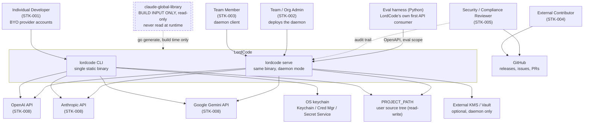
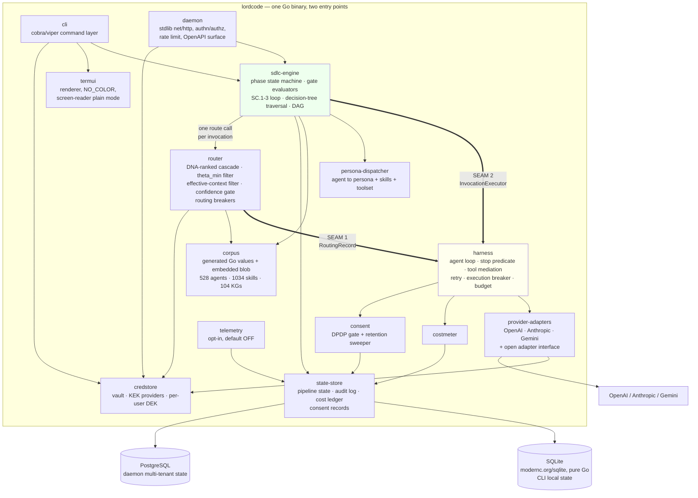

# High-Level Design (HLD) — LordCode

**Document ID:** HLD-20260904-01
**Version:** 1.0.0-draft
**Status:** DRAFT — pending STOP 3 (user review) and `consensus-agent` BINARY gate
**Author:** `solution-architect` (Phase 1)
**Date:** 2026-09-04
**Supersedes:** nothing (first HLD)

**Inputs consumed in full:** `docs/phase-0-requirements/PRD.md` (48 FR + 14 NFR) · `docs/phase-1-architecture/adr1_router_topology.md` · `docs/phase-1-architecture/provider_catalogue.md` · `docs/phase-1-architecture/cost_model.md` · `docs/phase-1-architecture/benchmark_methodology.md` · `docs/phase-1-architecture/harness_control_policy.json` · `docs/phase-1-architecture/resource_elastic_policy.json` · `docs/orchestration_prompt.md` · `docs/PIPELINE_STATUS.md` · `docs/phase-0-requirements/research_synthesis_round2.md`

**Mathematical delegation:** every capacity number, complexity bound, and reliability figure in §11 was derived by `mathematics-engineer` and is reproduced with its assumptions. This document derives nothing quantitative itself.

---

## 0. What This Document Decides, In One Page

| # | Decision | Verdict |
|---|---|---|
| **Alignment 6** | One engine or two? | **TWO, cleanly layered.** Harness = lower (executes one invocation). SDLC engine = upper (sequences phases, evaluates gates), a **client** of the harness. `harness-engineering-architect`'s position is **CONFIRMED**, on five arguments, two of which are new and decisive (§2.1). The exact interface is specified in §7.2. |
| **ADR-3** | Corpus storage form | **Amended form (b).** Compressed payload in one `go:embed`ed opaque blob addressed by code-generated offset constants; all identity, references and structure stay typed, compile-time-checked Go values. Neither of the two candidate forms as literally worded survives contact with Go's source-size arithmetic — §3.1 shows why, and this is a genuine finding, not a restatement. |
| **ADR-4** | Credential storage | **ONE mechanism:** a LordCode-owned envelope-encrypted vault (AES-256-GCM, per-credential DEK), with a **single pluggable KEK-provider port** whose selection order is deterministic and recorded in the vault header. The credential never enters the OS keychain; only the 32-byte KEK does. Headless path is Argon2id-derived, CI path is `ephemeral` (never written to disk). §4. |
| **ADR-5** | Distribution | **One signed artifact, four thin channels.** GitHub Releases is the sole source-of-truth artifact (cosign-signed, notarized, Authenticode-signed, SLSA provenance); Homebrew tap, Scoop bucket and an npm wrapper all download *that* artifact; `go install` works because the generated source and payload blob are committed. §5. |
| **ADR-7** | SDLC engine | **Hybrid with a decidable boundary:** pipeline **topology** is interpreted from the embedded decision-tree artifacts; gate **semantics** are hardcoded in Go behind a `GateEvaluator` interface. The boundary rule is "can the library's own `validate.py` check it?" — not a judgment call. §6. |
| **Benchmark scope** | Eval harness as Phase 1.5/B deliverable? | **ACCEPTED**, with a scope split: the OpenAPI **contract** the harness needs lands at Phase 1.5 (irreversible if missed); the Python harness and the 150–200-item cold-start bank land as new work item **B.10**. §8. |
| **CF-2** | RTM `HLD Component` column | **Filled** — §14 carries the complete replacement table for PRD §14.2. |
| **Reconciliation** | PRD §6 footnote / OQ-006 | The BA's reading is **confirmed and strengthened**: decompression is in-memory only, so there is genuinely no corpus cache directory. NFR-PERF-002 binds the config, vault, state-store and log directories, which do exist. §3.4. |

---

## 1. Requirements Baseline (restated, not re-derived)

### 1.1 Non-functional targets this design is built against

| Target | Value | Source |
|---|---|---|
| Availability (single-provider user, k=1) | Bounded by the provider's own availability — **LordCode publishes no SLA above it** (§11.4) | FR-RTG-002 |
| Availability (k≥2 configured providers) | **Ceiling ≈ 99.95%**, set by the correlated/common-mode term `1 − βU`, *not* by adding providers. Provider #2 is worth ≈ 3.3 h/month of avoided downtime; **provider #3 is worth ≈ 1 min/month** (§11.4). Product language must not imply otherwise — **AI-12**. | FR-RTG-002/004 |
| Daemon concurrency | NFR-DAE-001 states no number, so one is proposed and derived against (**definition D-1**, §11.3). The resulting budget is a hard engineering constraint: **serial fraction `f ≤ 0.20/(N−1)`** — i.e. **≤ 0.20% at N = 100** concurrent users. Per-user state shards (§9.4) are what make it reachable. | NFR-DAE-001 |
| Credential-path least-privilege score | `\|permissions_used\| / \|permissions_granted\| > 0.8` | NFR-DAE-002 |
| Phase F findings | Zero Critical/High at the F.6 gate | NFR-SEC-001 |
| CERT-In incident readiness | Detection-to-report ≤ 6h | NFR-SEC-002 |
| Supply chain | Zero install-time-script dependencies; reachability-based scanning in CI | NFR-SEC-003 |
| Cross-platform | Windows/macOS/Linux × amd64/arm64; spaces, non-ASCII, UNC paths | NFR-PERF-001 |
| Path resolution | Platform APIs only, never hardcoded literals | NFR-PERF-002 |
| Cost band | Typical **$0.8–$4.7** per requirement; **p95 ≈ $5.5**; up to **~$6.6** at full SC budget; bounded at **~$15.5** by §6.6's `R_max`/`N_max`. `cost_model.md` §5.5's published range excludes self-correction retries — **AI-7**. All of these are further subject to the unresolved 5.53× token-accounting discrepancy — **AI-9, BLOCKER**. | `cost_model.md` §5.5 + §11.8 |

### 1.2 Constraints treated as settled input, not re-litigated

- **ADR-2 (Go) is LOCKED** (CF-1). ADR-1 selected a DNA-ranked cascade, not embedding-similarity, so the single documented reopen trigger did not fire. No decision in this HLD requires on-device tensor operations beyond dot products over fixed-length vectors.
- **ADR-6 (network-exposed multi-tenant daemon) is in scope for v1.** `product-manager-agent` recommended a scope *sequencing* (design the daemon in Phase 1, let its implementation trail the CLI). This HLD adopts that sequencing: every daemon boundary is designed and contracted here; §9 marks which parts are B-phase implementation and which are fast-follower.
- **NEW-1 (corpus frozen).** No refresh mechanism. The overlay migration path is recorded as a future ADR (§3.6), not built.
- **CF-3.** No OpenAI OAuth surface in v1. The CLI contract and terminal UX offer the API-key flow only. This HLD defines no login surface for it.

---

## 2. Alignment 6 — The Verdict, Argued

> **The question:** does LordCode ship one merged engine, or two layered engines — the harness as the lower layer executing one invocation, the SDLC engine as the upper layer sequencing phases and evaluating gates, a *client* of the harness?

### 2.1 Verdict: TWO LAYERED ENGINES — CONFIRMED

`harness-engineering-architect`'s working position is **confirmed**. Its four arguments (WHAT/HOW split recursion, three-tier retry-hierarchy coherence, FR-SDL-005 orthogonality one layer down, B.1/B.3 parallelisability) are all sound and are adopted. Two further arguments are added here, and they are the decisive ones, because they turn a preference into a constraint:

**Argument 5 — the "core testable with no live API" constraint is only satisfiable under layering.**
This HLD is bound to produce a core that is fully testable with no live provider call. Under a merged engine, the smallest testable unit of "one invocation executes reliably under its stop predicate" would necessarily instantiate a phase state machine, because the stop predicate and the gate evaluators would live in the same object. The gate evaluators call `hallucination-detector`, `context-faithfulness-engineer`, `reliability-auditor` — every one of which is itself an LLM invocation. A merged engine therefore makes it structurally impossible to unit-test the stop predicate without either a live API or a mock of the entire gate chain. Under the layering, the harness depends only on a `ProviderPort` interface (Hexagonal ports/adapters, `clean-architecture` §13–15) and is tested against an in-memory fake that returns scripted responses. This is not a testing convenience; it is the difference between a testable core and an untestable one.

**Argument 6 — the benchmark methodology's eval harness cannot exist under a merged engine.**
`benchmark_methodology.md` §2.2 designs LordCode's paired-data engine as a Python tool driving the daemon over its OpenAPI surface, forcing each candidate model through *the same router filter/rank/dispatch path a real user invocation takes*. That requires the ability to execute **one invocation, on a named provider, with a scored response — without running an SDLC pipeline**. Under a merged engine there is no such call; the only entry point is "run a requirement through 40–80 invocations and 15 gates", which produces no per-item paired result and costs three orders of magnitude too much per data point. The eval harness is the mechanism that retires ADR-1 §6's placeholder effective-context ratios, supplies ADR-1 §9's SPRT quality signal, and produces the θ_min numerator. **A merged engine would make LordCode's own router permanently uncalibratable.** The layering is therefore load-bearing for the router's correctness, not only for code organisation.

### 2.2 What the layering does NOT mean

- It does **not** mean two binaries, two processes, or two deployables. Both engines are packages inside the single Go binary. The layering is a *dependency* boundary enforced at the module level (`clean-architecture` §25), not a deployment boundary.
- It does **not** mean the SDLC engine is a thin wrapper. It owns the phase state machine, gate evaluation, the SC.1–SC.3 loop, decision-tree traversal, DAG decomposition, and pipeline-state persistence — none of which the harness knows exists.
- It does **not** give the SDLC engine authority over stop conditions. See §7.2's binding property: the SDLC engine chooses an *invocation class*; the harness owns `T_max` and `B`. The engine cannot pass "unlimited".

### 2.3 Dependency direction (the rule an implementer enforces)

```
      sdlc-engine  ──depends on──▶  InvocationExecutor (port, defined by sdlc-engine)
                                              ▲
                                              │ implements
                                          harness
                                              │
                                     depends on ▼
                                       ProviderPort (port, defined by harness)
                                              ▲
                                              │ implements
                                    provider-adapters
```

`harness` **must not import** `sdlc-engine`. `provider-adapters` **must not import** `sdlc-engine` or `router`. Both rules are enforced by a build-time import-graph check (§10.4), not by convention — because a convention that is not checked is not a boundary.

Per `clean-architecture` M1, the target instability/abstractness placement is: `corpus` and domain types (I≈0, A≈1) · `sdlc-engine`, `router`, `harness` cores (I≈0.2, A≈0.8) · `provider-adapters`, `credstore` backends, `state-store` backends (I≈0.7, A≈0.3) · `cli`, `daemon` composition roots (I≈1, A≈0). The import-graph check reports `D = |A + I − 1|` per package so drift is visible, not asserted.

---

## 3. ADR-3 — Corpus Storage Form

**Status:** DECIDED (this HLD). The code-generation *mechanism* arrives already decided and is recorded, not re-litigated. Only the storage form was open.

### 3.1 Context — and a finding that changes the shape of the answer

The two candidates as stated in the ADR register:

| Form | Stated binary size | Stated access cost | Stated generated-source cost |
|---|---|---|---|
| (a) Plain Go string constants | ~90 MB+ | Zero | 56 MB of literals split across many files; long compile times |
| (b) Per-item gzip-compressed byte slices | ~25–30 MB | One decompress per access, cacheable for process lifetime | "Smaller, less readable generated source" |

**Form (b)'s claimed advantage on generated-source size does not survive arithmetic, and this is the finding that shapes the decision.** Compressed bytes are high-entropy: expressed as Go source they must be escaped. A Go string literal encodes a non-printable byte as `\xNN` — four source bytes per payload byte — and a `[]byte{0x1f, 0x8b, …}` literal is worse still at roughly six. Compressed data is overwhelmingly non-printable, so a gzip payload expands by roughly **3.5×** when written as Go source literals.

Applied to the measured figures: the corpus is 84.3 MB raw / 24.7 MB gzip in total, of which **56.2 MB raw is the persona and skill prose** that form (b) proposes to compress. The compressed size of the *prose subset specifically* is not given by any measurement this project holds — only the whole-corpus 24.7 MB is measured — so the honest bound is: if the prose compresses at the corpus-average ratio it is ≈ 16.5 MB, and at worst it is the full 24.7 MB. **Escaped as Go source literals that is ≈ 58 MB at the low end and ≈ 86 MB at the high end** — in both cases *at or above* form (a)'s 56 MB of prose literals, and fed to the compiler as a literal table, which is precisely the "punishing compile" form (b) was supposed to escape. **Form (b), read literally, buys a smaller binary by making the compile problem worse, not better — and it does so across the whole plausible range of the one input that is unmeasured**, which is what makes this a decision-changing finding rather than a quibble about a ratio. (`go-systems-engineer` reports the true prose-only compressed size as part of §3.5's measurement obligation; the conclusion does not depend on which end of the range it lands at.)

The resolution is to separate the two things form (b) conflated: **what is compiled** and **what is carried**.

### 3.2 Decision — amended form (b)

**LordCode carries the corpus as one `go:embed`ed, already-gzip-compressed opaque payload blob, addressed by code-generated offset/length constants. Every element of identity, reference, and structure remains a typed, compile-time-checked Go value in generated source.**

Concretely, `go generate` emits:

1. **Typed identity and structure, as ordinary generated Go** — small, fast to compile:
   - one package-level `var` per agent and per skill, of type `*corpus.Agent` / `*corpus.Skill`;
   - each `Agent` carries its resolved skill set as **`[]*corpus.Skill` pointing at those vars**, its KG route, its model tier, its declared tool set, and its invocation class;
   - the 104 domain knowledge graphs and the 23-node/82-branch decision tree become typed Go structures (nodes, branches, phases, patterns, typed edges) — structural data that is traversed, never displayed, so it is never compressed;
   - each `Agent`/`Skill` carries `payloadOffset` and `payloadLen` `uint32` constants instead of its prose.
2. **The prose payload, as one embedded blob** — the 56.2 MB of persona and skill text, each item independently gzip-compressed (so any item can be inflated without inflating its neighbours), concatenated, and `go:embed`ed as a single `corpus.bin`. Compressed size ≈ 16.5–24.7 MB per the bound in §3.1; the exact figure is measured, not assumed.

At runtime, resolving a persona is: follow a typed pointer → slice the blob at `[off : off+len]` → `gzip.Reader` → cache. No markdown is parsed, no JSON is unmarshalled, no file is opened, no directory is created.

### 3.3 Why this satisfies the non-negotiable, and why the naive reading does not

> **Non-negotiable, in either form: an agent naming a nonexistent skill must fail at BUILD time.** That is the whole reason code generation was chosen over file embedding.

This is satisfied **because the reference is a Go identifier, not a string key**. `agentSolutionArchitect.Skills = []*corpus.Skill{skillSystemDesign, skillCleanArchitecture, …}` — a skill that does not exist is an undefined identifier and the compiler refuses to produce a binary. The payload blob carries only opaque bytes addressed by generated integer constants; it participates in no lookup and therefore cannot mask a bad reference.

**The failure mode this deliberately forecloses:** had the generator emitted `skills["system-design"]` — a map keyed by string — a typo would compile cleanly and fail at dispatch, which is exactly the "hollow persona" runtime failure the library's `agent_persona.py` hook exists to catch and which ADR-3 exists to make impossible. **The generator MUST NOT emit string-keyed lookups for agent→skill resolution.** This is the single most important implementation constraint in ADR-3 and it is a build-time-verifiable property, not a style preference: a CI check greps the generated source for map-literal skill resolution and fails the build if any is found.

Three further build-time validators run in the same generation step (§10.4): the routability audit (FR-COR-004), the `library_version` provenance stamp (FR-COR-005), and blob-offset integrity (every `payloadOffset+payloadLen` lies within `len(corpus.bin)` and every byte of the blob is claimed by exactly one item — an unclaimed region means the generator dropped an item silently).

### 3.4 Consequences — including the PRD §6 / OQ-006 reconciliation

**Positive:**
- **Binary lands at 39–53 MB — not the ~25–30 MB the ADR register estimated (Finding 1).** The register's figure omitted the **incompressible Go binary floor**: the runtime, the compiled code, the KG typed structures, and the symbol/DWARF tables do not compress and are present in either form. The real saving over form (a) is **≈ 49 MB, a 2.1× reduction** — smaller than the headline suggested, but still decisive, because it is the difference between a binary in the normal range for a Go developer CLI and one that is not. **This correction is carried into ADR-5 (§5.2): 39–53 MB remains viable for Homebrew, Scoop, an npm wrapper and macOS notarization; ~90 MB is not.**
- **Compile time and distribution size are what this decision actually turns on (Finding 2).** The derivation settles a question the ADR register left as a live trade-off: **decompression is 0.01%–0.07% of total run time**, so *access latency is not a criterion at all* and must not be argued about further. What remains genuinely undetermined is compile time, which no existing artefact quantifies — which is why §3.5's measurement M4 (`go build` wall-clock, form (a) vs form (b′)) is the actual tiebreaker, and why this ADR is explicitly provisional on it.
- Compile time is expected to approach form (a)-without-literals, because the compiler sees a modest amount of structural Go and one embedded file rather than a 56–86 MB literal table. This matters directly to the open-contribution model (FR-CTB-001, NFR-CTB-001…005): a contributor who waits many minutes for every build contributes less.
- **No cache directory, no inflation step, no first-run latency, no partial-write failure mode.** Decompression is in-memory, for the lifetime of the process, and is never written to disk.

**This settles the tension PRD §6 flagged and OQ-006 carried forward.** The BA's reading was correct, and the amended form strengthens it: **there is no corpus cache directory, on any platform, in any mode.** NFR-PERF-002 binds the directories that genuinely do exist — the config directory, the credential vault, the CLI state store, and the log directory — each of which MUST resolve through `os.UserConfigDir()` / `os.UserCacheDir()` and never through a literal such as `~/.lordcode` or `%APPDATA%`. Confirmed as an architectural ruling, not left as an open flag.

**Negative, stated plainly:**
- The repository carries a ~16.5–24.7 MB binary artifact (`corpus.bin`, §3.1's bound) plus generated Go source. This is a one-time cost under NEW-1 (the corpus is frozen, so the blob does not churn per commit), but it is a real cost: `git clone` is heavier, and the generated files must be marked `linguist-generated=true` in `.gitattributes` so they do not drown code review.
- A committed generated artifact is a supply-chain surface: a tampered `corpus.bin` would ship silently. **The control is a CI job that re-runs `go generate` against the library pinned by commit SHA and fails if the output differs byte-for-byte.** This is the actual protection; committing the artifact without that job would be negligent. It runs on every PR, external ones included (NFR-CTB-004).
- Compiled-in personas cannot be hot-updated without a rebuild and release. Under NEW-1 this is a non-issue; §3.6 records the migration path.

**Rejected alternatives:**
- *Form (a), plain string constants* — rejected on binary size (~90 MB closes distribution channels ADR-5 needs) and compile time (a direct tax on the contribution model).
- *Form (b) read literally, as per-item `[]byte` literals in generated source* — rejected on the §3.1 finding: ~85 MB of escaped source is a worse compile problem than form (a), so the form does not deliver its own stated advantage.
- *`embed.FS` over the raw markdown tree with runtime parse* — rejected because it returns the hollow-persona failure to runtime, which is the exact thing ADR-3 exists to prevent, and because it reintroduces the startup parse cost of `agents_all.json` / `edges_all.json` that code generation removes.
- *Fetching the corpus at build time from a release artifact* — rejected: a build-time network fetch is a worse supply-chain posture than a committed, hash-verified artifact, and it breaks the hermetic build that makes `go install` and external contribution work.

### 3.5 Measurement obligation (Alignment 5 — measurement wins over plan)

`go-systems-engineer` owns the codegen implementation and **MUST** report, from a spike on the real corpus, before B.4 is accepted:

| Metric | Both forms | Why it can overturn this ADR |
|---|---|---|
| Binary size (per OS/arch, stripped and unstripped) | (a) and (b′) | If (b′) does not land under ~40 MB, ADR-5's channel set needs revisiting |
| Clean compile time and incremental compile time | (a) and (b′) | If (b′)'s compile is not materially better than (a), the main non-size argument for (b′) evaporates |
| First-persona-access latency, cold | (b′) | If a single inflate is not comfortably sub-millisecond, §11.1's amortisation argument needs rechecking |
| Steady-state RSS for a full pipeline run (CLI) and for a 10-user daemon | (b′) | Feeds the cache-sizing decision in §11.2 |
| Generated-source line count and byte size | (a) and (b′) | Confirms or refutes the §3.1 arithmetic against the real corpus |
| **Prose-only compressed size** (gzip of the 56.2 MB persona/skill subset alone) | (b′) | The one input §3.1 bounds rather than knows; closes the 16.5–24.7 MB range and pins the blob and binary size |

**If measurement contradicts this decision, the ADR is amended and the measurement wins.** That is Alignment 5's contract and it is binding on this document, not advisory.

**Six cheap measurements collapse the uncertainty band from ±29 MB to ±2 MB.** `mathematics-engineer` names them precisely; they are dispatched to `go-systems-engineer` under the same Alignment 5 mandate:

| # | Measurement | Closes | Uncertainty removed |
|---|---|---|---|
| M1 | `gzip -9` each subtree separately (`agents/`, `skills/`, `knowledge-graph/`) | The prose/KG compressed split — the input §3.1 can only bound | ±2.5 MB |
| M2 | Build the binary with real code and dependencies but a **stub** corpus | The incompressible Go binary floor `F_go` — the term Finding 1 shows the ADR register omitted | ±10 MB |
| M3 | Emit the KG as typed Go and compile it alone | The KG payload term `K_payload` | ±17 MB |
| M4 | Wall-clock `go build`, form (a) vs form (b′) | **The actual ADR-3 tiebreaker**, which no current artefact quantifies at all | — |
| M5 | Count `skills:` entries across all 528 `agent.md` files | Mean skills-per-agent `k` | 4.3× on the cache working set |
| M6 | Benchmark **Go's** `compress/gzip` throughput on the real corpus | Decompress time — Go's `compress/flate` runs 60–150 MB/s, not the 150–400 MB/s C-zlib band | 6.7× on decompress time |

M2 and M3 together are what turn Finding 1's 39–53 MB into a number rather than a band, and M4 is the one that could genuinely reverse this ADR.

### 3.6 Future-ADR note (do not build now)

If NEW-1 is ever revisited, the migration path is an overlay: the compiled corpus stays the floor; an updated corpus is layered over it at runtime with the same typed-reference discipline enforced at load time instead of compile time (which is strictly weaker, and is the reason not to do it while the corpus is frozen). Record as a future ADR.

---

## 4. ADR-4 — Credential Storage

**Status:** DECIDED (this HLD), **subject to security veto at Phase F** per Alignment 3. `threat-modeling-specialist` (F.1), `crypto-security-specialist` (F.4) and `security-lead-auditor` (F.6) may reject this ADR; their rejection is binding, not advisory.

### 4.1 Decision — ONE mechanism

> Alignment 3 requires one concrete mechanism with Chosen/Rejected reasoning. A menu is not a decision. What follows is one mechanism.

**LordCode stores every provider credential in a LordCode-owned, envelope-encrypted vault. The credential itself never enters an OS keychain, an environment variable, or a config file. Only a 32-byte Key Encryption Key (KEK) is held outside the vault, by exactly one KEK provider selected at first run and recorded in the vault header.**

```
vault file (single format, all platforms, both CLI and daemon)
├── header (plaintext, authenticated)
│     ├── vault_format_version
│     ├── kek_provider_id            ← "os_keychain" | "passphrase" | "external_kms"
│     ├── kdf_params                 ← Argon2id salt + parameters, present iff passphrase
│     └── created_at, last_rotated_at
└── entries[]  (one per (user_id, provider))
      ├── nonce (96-bit, unique per write)
      ├── ciphertext  = AES-256-GCM( DEK, credential )
      └── AAD         = vault_format_version ‖ user_id ‖ provider ‖ entry_version

DEK  = HKDF-SHA256( KEK, salt = vault_id, info = "lordcode/dek/v1" ‖ user_id )
```

**The mechanism is one thing — the vault — and the platform differences collapse into which provider holds a 32-byte key.** That is what makes this a single mechanism rather than a menu: one file format, one encryption scheme, one read path, one write path, one audit point, one place where "never logged" is enforced.

### 4.2 KEK provider selection order (deterministic, recorded, never silently re-selected)

| Order | Provider | Where the KEK lives | When selected |
|---|---|---|---|
| 1 | `os_keychain` | macOS Keychain / Windows Credential Manager / Linux Secret Service, via `zalando/go-keyring` (pure Go — preserves `CGO_ENABLED=0`) | A Secret Service is reachable at first run |
| 2 | `passphrase` | Nowhere. Derived on demand: `KEK = Argon2id(passphrase, salt, t=3, m=64 MiB, p=4, len=32)` | Interactive session with no Secret Service — SSH, a headless workstation |
| 3 | `ephemeral` | Process memory only, for the lifetime of one command or one daemon process; **no vault file is written at all** | Non-interactive with no Secret Service — CI, containers |
| 4 | `external_kms` | An operator-configured KMS/Vault endpoint returning the KEK | Daemon deployments that already run a KMS |

The selected provider is written into the vault header at creation and is **never silently changed**. A later run in a different environment that cannot reach the recorded provider fails loudly, naming the recorded provider and the resolved path — it does not fall back, because a silent fallback to a weaker provider is a downgrade attack with a friendly error message.

### 4.3 The headless path, designed rather than deferred

> This is where DPDP §4 and CERT-In scrutiny will land, so it is designed here, not left to implementation.

Two headless cases exist and they get different answers, because they have different threat models:

**Headless interactive (SSH into a workstation or build host, a human is present).** Provider 2. The KEK is derived from a passphrase with **Argon2id** — chosen over PBKDF2 and scrypt because it is the current password-hashing recommendation, is memory-hard against GPU and ASIC attack, and is available in pure Go (`golang.org/x/crypto/argon2`) without CGO. Parameters `t=3, m=64 MiB, p=4` are stated here so they are reviewable and so a future weakening is a visible diff rather than an unexamined default. The salt is 128-bit, per vault, stored in the header. The derived KEK is held in memory for the process lifetime and zeroed on exit; the passphrase itself is never stored, never logged, and never passed as an argument (it is read from the terminal with echo disabled, or from stdin with `--passphrase-stdin`).

**Headless non-interactive (CI, containers, no human).** Provider 3, `ephemeral` — and this is the load-bearing design choice: **in an environment where LordCode cannot protect a key at rest, it does not write a credential to rest at all.** The credential is supplied per run from the CI system's own secret store via `lordcode auth login <provider> --stdin --ephemeral`, lives only in process memory, and dies with the process. There is no vault file, so there is nothing to steal from the filesystem, nothing to back up accidentally, and nothing to leave behind in a container layer.

**This deliberately closes the path most tools take here.** The obvious alternative — put the KEK in an environment variable so an unattended vault can be opened — is **rejected**. Environment variables appear in `/proc/<pid>/environ`, are inherited by every child process (and LordCode's tool-mediation layer does permit shell execution), leak into crash dumps and CI logs, and are the exact pattern `cloud-security-core` names as a secrets anti-pattern. The residual risk of `ephemeral` is that a long-lived CI job must re-supply the credential per run; that is a real ergonomic cost and it is the right trade for a CRITICAL-security binary holding several users' provider credentials.

### 4.4 Per-user isolation on the multi-tenant daemon

Isolation is **cryptographic and structural, not an access-control check that a bug could bypass** — which is what makes AC-FR-DAE-003 testable rather than merely asserted:

1. **Per-user DEK.** `DEK_u = HKDF(KEK, info = "lordcode/dek/v1" ‖ user_id)`. User A's DEK cannot decrypt user B's entry.
2. **AAD binding.** The AEAD's Additional Authenticated Data includes `user_id` and `provider`. If a row is swapped between users — by a query bug, a cache mix-up, or a restore from the wrong backup — GCM authentication **fails**; it does not silently return the wrong plaintext. This converts a class of logic bug into a loud cryptographic error.
3. **Narrow port.** The credential store exposes exactly four operations, split into two ports so the least-privilege score is computable per consumer rather than for the whole component:

```go
// CredentialReader is the only credential-store surface the router and harness see.
type CredentialReader interface {
    // Get returns the decrypted credential for one user and provider.
    // It is the sole read path; there is no bulk read and no list-with-values.
    Get(ctx context.Context, userID UserID, p ProviderID) (Secret, error)
}

// CredentialAdmin is reachable only from the auth command layer and the daemon's
// own account endpoints. It is never wired into the router, harness, or SDLC engine.
type CredentialAdmin interface {
    Put(ctx context.Context, userID UserID, p ProviderID, s Secret) error
    Delete(ctx context.Context, userID UserID, p ProviderID) error
    ListMetadata(ctx context.Context, userID UserID) ([]CredentialMeta, error) // never values
}
```

Against NFR-DAE-002's `|permissions_used| / |permissions_granted| > 0.8`: the router and harness are granted `CredentialReader` (1 operation) and use 1 → score **1.0**. The auth command layer is granted `CredentialAdmin` (3) and uses 3 → **1.0**. A single wide interface would have scored 1/4 = 0.25 for the router and failed the NFR — the split is what makes the target reachable, not a coincidence of counting.

### 4.5 Secrets never in logs (FR-SEC-002), enforced by the type system

`Secret` is a distinct type whose `String()`, `GoString()`, `MarshalJSON()`, and `MarshalText()` all return `"[REDACTED]"`. A `Secret` therefore cannot be accidentally rendered by `%v`, `%s`, `%+v`, a structured-log field, or a JSON error body. Its plaintext is reachable only through an explicit `.Reveal()` call. **A CI lint fails the build on any `.Reveal()` outside `provider-adapters`** — that is the only package that legitimately needs the plaintext, to set an `Authorization` header. This makes "no credentials in logs" a compile-and-lint property rather than a review discipline.

### 4.6 Rejected alternatives

| Rejected | Why |
|---|---|
| Store the whole credential in the OS keychain | Not one mechanism — it forks the code path at the platform boundary, so the audit point, the least-privilege score, and the "never logged" enforcement each exist twice. Keychain backends also have practical value-size and prompt-behaviour differences across the three platforms, and none of them gives per-user isolation on a daemon. Keychains are good at holding one small secret; that is exactly the role kept for them (the KEK). |
| Encrypted config file with a key derived from machine identity (hostname, MAC, machine-id) | Defeated by any attacker who already has the file, since the "key" is readable from the same host. It looks like encryption and is obfuscation. |
| Env-var-only credentials | `/proc/<pid>/environ`, child-process inheritance, crash dumps, CI log leakage. Named as an anti-pattern by `cloud-security-core`. |
| Plaintext config file (`~/.lordcode/credentials.json`) | Fails FR-SEC-001 outright. |
| Delegating entirely to an external KMS for all deployments | Correct for a daemon with an existing KMS (kept as provider 4) but wrong as the only mechanism — it makes a single-developer CLI depend on infrastructure the PRD's primary user (STK-001) does not have. |

### 4.7 What security may reject, stated so the review is efficient

The three points most likely to draw a Phase F objection, named in advance rather than discovered: (a) the Argon2id parameters, which are a defensible-but-arguable point on the memory-hardness/UX curve; (b) whether `ephemeral` is operationally acceptable for the CI use case or whether the friction will drive users to worse workarounds; (c) whether the `external_kms` provider needs to be mandatory rather than optional for any network-exposed daemon deployment. This HLD's position on (c) is that it should be **recommended and documented, not mandatory**, because mandating it would block the small-team daemon deployment ADR-6 exists to serve — but this is precisely the kind of call security holds veto over.

---

## 5. ADR-5 — Distribution and Packaging

**Status:** DECIDED (this HLD). Owner for implementation: `release-engineering-specialist`.

### 5.1 Decision

**One signed artifact set, four thin channels, one hermetic build.**

| Tier | Channel | v1 GA | Mechanism |
|---|---|---|---|
| **Source of truth** | **GitHub Releases** | **Yes** | Per-OS/arch binaries + `SHA256SUMS` + cosign signature + SLSA v1 provenance attestation. macOS builds notarized and stapled; Windows builds Authenticode-signed. |
| Thin wrapper | **Homebrew tap** (`lordcode/tap`) | Yes | Formula downloads the GitHub Release artifact and verifies its checksum. Ships no independent build. |
| Thin wrapper | **Scoop bucket** | Yes | Manifest downloads the same artifact, same checksum verification. |
| Thin wrapper | **npm wrapper** (`lordcode`) | Yes | Postinstall downloads the platform artifact and verifies checksum + cosign signature. Reaches the npm audience without an npm dependency tree. |
| Native | **`go install`** | Yes, free | Works because the generated source and `corpus.bin` are committed (§3) and the build is hermetic. **Caveat stated in docs: `go install` produces an unsigned, unnotarized binary** — correct for contributors, not the recommended path for users. |
| Deferred | Docker image | Fast-follower | Mostly relevant to the daemon; ADR-6 sequencing puts daemon *implementation* after the CLI. |
| Deferred | apt / rpm / AUR | Fast-follower | Highest per-channel maintenance cost, lowest marginal reach at launch. AUR is community-maintainable. |

### 5.2 Rationale

- **One artifact, many channels** is what keeps signing tractable. Notarization and Authenticode are per-artifact costs; if Homebrew, Scoop and npm each built independently there would be four artifacts to sign per platform per release and four chances for them to diverge. Every channel above downloads the *same* signed bytes and verifies them.
- **The binary size decision in §3 is what makes this list possible.** A ~90 MB binary (form (a)) is awkward-to-hostile for an npm postinstall download, for Homebrew bottle sizes, and for notarization upload cycles. **39–53 MB** (form (b′), per Finding 1's corrected estimate — *not* the ~25–30 MB the ADR register assumed) is unremarkable for a Go developer CLI and comfortably within every channel's practical limits.
- **`go install` working is a contribution-model feature, not a user feature.** It is the reason an external contributor can build and run LordCode without possessing `claude-global-library` — which they cannot, since it is a separate private repository. This is a direct consequence of committing the generated source (§3.4) and is a second, independent argument for that choice.
- **Signing is a forced cost, budgeted explicitly:** an Apple Developer account and a code-signing certificate. Named here so it is a line item, not a launch-week surprise.

### 5.3 Consequences

- Release is a single CI workflow producing all artifacts from one commit, with provenance attestation. A release that fails to produce provenance does not publish.
- The npm wrapper's postinstall **does download over the network**, which is exactly the class of behaviour NFR-SEC-003 is suspicious of. The mitigation is that it downloads a cosign-signed artifact and verifies the signature before use — and that the wrapper is a *convenience channel*, never the channel the security-sensitive user is directed to. Documented as such.
- Reproducibility: `-trimpath`, pinned Go toolchain version, and `CGO_ENABLED=0` for all targets. `CGO_ENABLED=0` is not a preference — it is what keeps cross-compilation to six OS/arch targets a single build matrix, and it is why `zalando/go-keyring` and `modernc.org/sqlite` were selected over their CGO-requiring alternatives (§10.2).

---

## 6. ADR-7 — SDLC Pipeline Engine: Hardcoded or Interpreted

**Status:** DECIDED (this HLD). This was a genuine architectural fork and is argued, not pre-selected.

### 6.1 The fork, stated fairly

*Interpreted* keeps LordCode's pipeline faithful to the library it embeds: the decision tree (23 nodes / 82 branches), the 39 phase nodes and the 36 collaboration patterns are already machine-traversable JSON with their own validator and an authoritative manifest. FR-SDL-003 is explicit that the decision tree is "a traversable runtime artifact ... not documentation", so at least the routing half is mandated interpreted.

*Hardcoded* is simpler and faster: a Go state machine with a `switch` over phases, gates as methods, no interpreter to write or debug.

The tension is real, and neither answer is right for the whole engine.

### 6.2 Decision — hybrid with a decidable boundary

**The pipeline's TOPOLOGY is interpreted from the embedded artifacts. The pipeline's GATE SEMANTICS are hardcoded in Go behind a `GateEvaluator` interface, one implementation per gate kind.**

| Interpreted (data) | Hardcoded (Go) |
|---|---|
| Which phases exist and their order (`phases.json`) | What "consensus BINARY APPROVED" *means* and how to compute it |
| Which decision node routes where under which condition (`decision_nodes.json`, `decision_branches.json`) | `RS = (NLI × FactScore × DRE × Coverage)^(1/4) = 1.0` |
| Which collaboration pattern a requirement matches, and its lead agent / lead math master (`patterns.json`) | Phase F all-severities-zero |
| Which phases a branch emits and which it prunes | Phase H: pass-rate ≥ 0.98 over 5 replays, McNemar p > 0.05, Krippendorff α ≥ 0.80 |
| The DAG of parallel groups within a phase | PRR GO / NO-GO |
| | Coverage = 1.0, DRE = 1.0 |

### 6.3 Why this is a boundary and not a fence-sit

The boundary is drawn by a rule an engineer can apply to an artifact they have never seen before:

> **Can the library's own `validate.py` check it?** If yes, it is data and LordCode interprets it — the library owns the artifact and guarantees its shape. If no, it is behaviour and LordCode hardcodes it — LordCode owns the semantics and Go's type system guarantees them.

Applied: `decision_nodes.json`, `decision_branches.json`, `phases.json`, `patterns.json` and `manifest.json` all have a 24-check validator with authoritative counts, and the library's own rules require that validator to exit 0 before any commit. The gate formulas do not — they exist as prose in `ORCHESTRATION_TEMPLATE.md` and the pipeline specs. Interpreting them would require inventing an expression language the library does not ship and cannot validate, which is a DSL nobody asked for and a second, unvalidated source of truth for the most safety-critical logic in the product. Hardcoding a formula the library states in prose is not infidelity to the library; **writing a private interpreter for prose the library never machine-encoded would be.**

### 6.4 Making the boundary itself compile-time-checked

The gate kinds are a closed set, and Go has no sum types — so exhaustiveness has to be arranged, not assumed. **The generator emits the `GateKind` constants from `phases.json`**, exactly as it emits agent and skill identifiers (§3.2). A phase naming a gate kind for which no Go evaluator is registered is therefore an undefined identifier at build time, not an unhandled `default:` at runtime. This is the ADR-3 discipline applied one layer up, and it is the mechanism that keeps "interpreted topology" from becoming "runtime surprise".

```go
// GateEvaluator decides whether one phase gate passes for one requirement.
//
// Implementations are registered once per GateKind at package init and the
// registry is checked for completeness against the generated GateKind set, so a
// phase whose gate has no evaluator cannot reach execution.
type GateEvaluator interface {
    Kind() GateKind
    Evaluate(ctx context.Context, in GateInput) (GateVerdict, error)
}

// GateVerdict is the sole result type. A gate never returns a bare bool: the
// reason and the measured values are what the SC.1-3 loop and the audit trail
// consume, and an evaluator that cannot explain a rejection cannot be acted on.
type GateVerdict struct {
    Pass     bool
    Reason   string
    Measured map[string]float64 // e.g. {"NLI":1.0,"FactScore":1.0,"DRE":1.0,"Coverage":1.0}
}
```

### 6.5 Consequences

- Adding a **phase** to the library is a data change: regenerate, rebuild, ship. Adding a **gate kind** is a Go change. Under NEW-1 neither happens in v1, so the split costs nothing today and leaves the right seam if NEW-1 is revisited.
- FR-SDL-003 is satisfied literally: routing is a real traversal of the compiled tree, and AC-FR-SDL-003's requirement that "the traversal path taken is recorded in the run's audit trail" is met by emitting the visited node/branch id sequence into the pipeline-state record.
- The SC.1–SC.3 loop (FR-SDL-002) is hardcoded: at most 3 retries of the failing step, then escalate to a human. It is implemented as a bounded counter on the *phase* record, not on the invocation, which is what keeps tier 3 of the retry hierarchy structurally above tiers 1 and 2 (§7.4).
- Risk accepted: an interpreter has a class of bug a `switch` does not (a malformed branch condition). The mitigation is that the artifact is validated at generation time by the library's own validator semantics, re-checked by the CI regeneration job, and that traversal is deterministic and recorded — so a mis-traversal is visible in the audit trail rather than silent.

### 6.6 The pipeline needs its own termination guarantee — `R_max` and `N_max`

> **This subsection is a design addition, not a restatement. It exists because `mathematics-engineer`'s derivation found a defect (Finding 23, BLOCKER-severity) that no requirement in the PRD covers.**

FR-SDL-002 bounds *per-gate* retries at 3. Nothing bounds **RE_ROUTE** — the SC.1–3 path that, on an `architecture_gap` cause, sends the run back to Phase 1, and on a `wrong_design_assumption` cause, back to Phase 0. A run can therefore re-enter an earlier phase, get three fresh SC attempts at every subsequent gate, fail again, and re-route again. **Each individual loop is bounded; their composition is not — so the SDLC pipeline as currently specified has no termination guarantee.**

This is precisely the defect `harness_control_policy.json` correctly guards against one layer down, where `T_max` is called "the ONLY unconditional termination guarantee" specifically because `isFinal` alone provides none. The pipeline layer had no analogue. It does now:

| Bound | Default | Counted on | Behaviour at the bound |
|---|---|---|---|
| **`R_max`** — global re-route cap per requirement | 2 | The **requirement** record | A third re-route escalates to a human instead of re-entering an earlier phase |
| **`N_max`** — hard ceiling on total agent invocations per requirement | 320 | The **requirement** record | Escalates to a human with full state preserved |

**Both are counted on the requirement record, not the phase record.** That is the load-bearing detail: a counter held on the phase record is reset by re-entering the phase, which is the exact mechanism that made the composition unbounded in the first place.

**`N_max` is the stronger of the two**, and is the pipeline's actual termination guarantee, because it terminates the run even if a future artifact change introduces a re-route path that `R_max` does not model — the same reasoning that makes `T_max`, not `isFinal`, the harness's guarantee. Neither bound is user-configurable to "unlimited", for the same reason `B` is not (§7.4 property 1).

**Cost consequence, stated because it is material and currently unpublished.** `cost_model.md` §5.5's headline **$0.80–$4.70 per requirement** is computed from `N ∈ [40, 80]` with **no self-correction-retry term at all**. Including SC retries, the derivation gives p95 ≈ **$5.5**, up to ≈ **$6.6** when every gate exercises its full SC budget, and up to ≈ **$15.5** under a full re-route — the last figure being finite *only because* `R_max` and `N_max` now exist. The honest published statement is:

> Typical **$0.8–$4.7** per requirement; **p95 ≈ $5.5**; up to **~$6.6** when every gate exercises its full SC.1–SC.3 budget; bounded at **~$15.5** by `R_max`/`N_max`.

`cost_model.md` must either state that its range excludes self-correction, or widen it — tracked as **AI-7**.

---

## 7. Architecture

### 7.1 C4 Level 1 — System Context



**The dashed edge is the whole product thesis.** `claude-global-library` is a build input and is never opened at runtime. Persona and skill resolution touch neither the filesystem nor the network; only provider inference calls leave the process.

### 7.2 C4 Level 2 — Containers and the two seams that must not rot



**Both double-lined edges are the seams Alignment 1 and Alignment 6 warned would rot if left implicit. They are specified in §7.3 and §7.4.**

Note the direction of Seam 1: the **SDLC engine** asks the router for a decision and hands the resulting record to the harness. The router is not called by the harness on the happy path — the one exception is a circuit-breaker fallback, which the harness *requests* and the router *decides* (§7.5).

### 7.3 SEAM 1 — Router → Harness handoff (Alignment 1)

ADR-1 §7's schema is **adopted, with four amendments.** Each amendment closes a specific way the seam would have rotted.

**Amendment A — `fallback_from` is a real field.** ADR-1 §7 describes it in prose but omits it from the schema. Added: `fallback_from: invocation_id | null`.

**Amendment B — resolve the contradiction between ADR-1 §7 and `resource_elastic_policy.json`.**
ADR-1 §7 says a circuit-breaker fallback produces "a fresh record with a new `decided_at`… not a mutation of the original record." `resource_elastic_policy.json` step 5 says "the invocation resumes… with its ORIGINAL `T_max`/`B` budget continuing from where it left off — a fallback is a provider substitution within the same invocation, not a new invocation." Read carelessly, these conflict; read carefully, they are about different objects, and the HLD must say which is which or an implementer will pick one and break the other.

> **Ruling: the `invocation_id` is stable across a provider substitution; the routing record is not.** One invocation has one identity, one budget envelope, one `T_max` clock, and **N ≥ 1 immutable routing records** distinguished by a new field `routing_decision_seq` (monotone from 0 within the invocation). ADR-1's immutability holds — no record is ever mutated. `resource_elastic_policy`'s budget continuity holds — the budget belongs to the invocation, not to the record.

**Amendment C — split cost into estimate and actual, with distinct owners.** ADR-1 §7's single `cost_estimate_usd` cannot satisfy FR-HRN-002, which demands "a real, replayable answer rather than an estimate" for what an invocation cost. Added: the router writes `cost_estimate_usd` (pre-flight, from the CPST table) into the routing record; the **harness** writes `cost_actual_usd` and `usage` into the invocation result, per `routing_decision_seq`. Two fields, two owners, one joined record.

**Amendment D — `pricing_table_version`, and a ruling on how the pricing table is refreshed.** `provider_catalogue.md` §1.1 flagged that the router's pricing table must be refreshable independently of a code release and explicitly deferred the mechanism to this document. Without a version stamp, replaying a recorded cost decision is not reproducible, so the field is required. **Ruling on the mechanism: the pricing table is a signed, versioned data file. The binary ships a compiled-in default; an operator may override it with a locally-provided file that is signature-verified before use. LordCode does not fetch the pricing table over the network.** A network-fetched, unsigned table would let an off-host party influence routing decisions on a CRITICAL-security binary, and it would break the offline guarantee that persona resolution never touches the network. Refresh is therefore: a new release, or a signed operator override.

The resulting record (fields added by this HLD marked `NEW`):

```jsonc
{
  "invocation_id": "uuid",
  "routing_decision_seq": 0,                 // NEW (Amendment B)
  "fallback_from": null,                     // NEW (Amendment A)
  "requirement_id": "uuid",
  "sdlc_phase": "F.1",
  "dispatched_agent": "threat-modeling-specialist",
  "routing_decision": {
    "topology": "dna-ranked-cascade-v1",
    "router_topology_version": "dna-ranked-cascade-v1",
    "pricing_table_version": "2026-09-04.1",  // NEW (Amendment D)
    "task_requirement_vector_R": [ /* 10 axes */ ],
    "candidate_pool_before_filters": [ /* ... */ ],
    "theta_min_filter":          { "threshold": 0.60, "excluded": [ /* ... */ ] },
    "effective_context_filter":  { "task_class": "multi_hop_reasoning",
                                   "required_tokens": 0,
                                   "indic_correction_applied": false,
                                   "excluded": [ /* ... */ ] },
    "configured_provider_filter":{ "user_configured_providers": [ /* ... */ ],
                                   "excluded_unconfigured": [ /* ... */ ] },
    "circuit_breaker_filter":    { "excluded_open": [ /* ... */ ] },
    "ranked_candidates": [ /* {model, S_cap, S_cost, S_lat, S_composite, weights_used} */ ],
    "selected": { "provider": "google", "model": "gemini-*" },
    "substitution": { "occurred": true,
                      "top_ranked_before_substitution": "anthropic/claude-*",
                      "unavailable_reason": "unconfigured_provider" },
    "confidence_gate": { "risk_class": "security_critical",
                         "threshold_tau_star": 0.0, "observed_confidence": 0.0,
                         "escalated": false, "escalation_chain": [] },
    "cost_estimate_usd": 0.0
  },
  "decided_at": "ISO-8601"
}
```

**Binding properties (unchanged from ADR-1 unless noted):** the record is immutable once emitted; the router never re-invokes itself mid-loop against the same `(invocation_id, routing_decision_seq)`; re-routing occurs only on a genuinely new invocation or an explicit harness-triggered breaker fallback, which emits `seq+1` with `fallback_from` set; `substitution` is populated whenever FR-RTG-005's degrade-to-best-available path fires, satisfying AC-FR-RTG-004 verbatim.

### 7.4 SEAM 2 — SDLC engine → Harness dispatch (Alignment 6)

> `harness_control_policy.json` names this as "the seam `consensus-agent`'s gate treats as mandatory". It is specified here in full.

```go
// InvocationExecutor is the sole surface the SDLC engine has on the harness.
// It is declared in the sdlc-engine package (consumer-defined port), so the
// harness depends on nothing above it.
type InvocationExecutor interface {
    Execute(ctx context.Context, req InvocationRequest) (InvocationResult, error)
}

// InvocationRequest is everything the harness needs to run exactly one agent
// invocation to completion. It deliberately carries no phase state, no gate
// results, and no budget scalars.
type InvocationRequest struct {
    InvocationID  InvocationID
    RequirementID RequirementID
    Phase         PhaseID          // generated from phases.json; opaque label for the audit record
    Agent         *corpus.Agent    // typed pointer - a nonexistent agent cannot be expressed
    Routing       RoutingRecord    // seq 0, from the router (Seam 1)
    ToolSet       []tools.Tool     // 3-5 per tool-call-mediation-core
    Class         InvocationClass  // ClassR | ClassI | ClassS - selects T_max and B
    Context       ContextWindow    // per-user isolated (DPDP Act 2023 s.4)
    UserID        UserID           // credential and workspace scoping
}

// InvocationResult reports how one invocation ended, with everything the audit
// trail, the cost display, and deterministic replay require.
type InvocationResult struct {
    FinishReason   FinishReason  // stop | tool-calls | length | aborted
    AbortReason    AbortReason   // t_max | budget | stopWhen | cancelled; set iff aborted
    Output         []byte
    ToolTrace      []ToolCall    // ordered, sufficient for replay (FR-HRN-001)
    Usage          []Usage       // one entry per routing_decision_seq
    CostActualUSD  Money         // FR-HRN-002: recorded, never estimated
    RoutingRecords []RoutingRecord // seq 0..N-1, including any breaker fallbacks
}
```

**Six binding properties. Each exists to prevent a specific way the layering could be eroded in code review:**

1. **`Class`, not `Budget`.** The SDLC engine selects an invocation class; the harness resolves `T_max` and `B` from `harness_control_policy.json`. The engine cannot pass "unlimited" or a raised ceiling, so FR-HRN-003's mandatory stop disjuncts cannot be disabled from above. A request with an unknown class is rejected before any provider call.
2. **The harness never reads phase state.** `Phase` is an opaque label written to the audit record. The harness has no accessor for gate results, prior phases, or the SC counter.
3. **The SDLC engine never sets stop-predicate parameters.** There is no field for it, so no future PR can add one without changing this interface and this document.
4. **Provider failure is a `Result`, not an `error`.** `Execute` returns a non-nil `error` only for harness-internal faults (unknown class, malformed request). A provider outage, a tripped breaker, or a `T_max` abort come back as `FinishReason: aborted` with an `AbortReason`. Two channels for the same condition is how callers end up handling one and forgetting the other.
5. **`RoutingRecords` flows upward, not downward.** A breaker fallback happens *inside* the harness's execution; the engine learns of it only for the audit trail and never acts on it. This preserves Alignment 7: a provider substitution cannot change which agents the engine dispatches.
6. **An `aborted` result is never reported as `stop`.** Carried verbatim from `agent-loop-lifecycle-core` via `harness_control_policy.json`, which names the conflation "a correctness bug". The `AbortReason` sub-field is what makes AC-FR-HRN-003's requirement — a `T_max` stop logged distinctly from a budget stop — a type-level guarantee rather than a logging convention.

**The proof that this seam is real, not decorative:** `POST /v1/eval/invocations` on the daemon (§8.2) maps directly onto `InvocationExecutor.Execute` with the SDLC engine absent from the call path. If the layering were cosmetic, that endpoint could not be built.

### 7.5 Retry hierarchy — three tiers, and where each one lives

`harness_control_policy.json`'s three-tier hierarchy is adopted unchanged, with ownership made explicit against the components in §7.2:

| Tier | Mechanism | Owner component | Scope of recovery | Escalates to |
|---|---|---|---|---|
| 1 | Tool/provider call retry, `k ≤ 3`, full jitter, `delay(n) = U(0, min(30s, 1s·2ⁿ))` | `harness` | One HTTP/tool call, seconds | Tier 2 |
| 2 | Circuit breaker (execution), `N=20` window, `θ=0.5`, `τ=30 s` doubling to 300 s, 1 half-open probe | `harness` | One (provider, tier), seconds-to-minutes; fails fast and requests a router fallback | Tier 3 only if the phase gate then fails |
| 3 | SC.1–SC.3 self-correction, ≤ 3 iterations then human escalation | `sdlc-engine` | One phase gate, minutes-to-hours | Human (FR-SDL-002) |

**Hard rule, restated because it is the rule most likely to be violated under delivery pressure:** a tier-1 retry exhausting its cap is **not** an SC.1 event. It surfaces as a tool-result observation the model may react to. Only a *gate-level* REJECT/FAIL triggers SC.1–3. Conflating them would make the SC counter advance on transient network noise and exhaust a requirement's three human-escalation-free attempts on a flaky connection.

**Two distinct breakers exist and must not be merged** (`harness_control_policy.json` states this; it is repeated here because merging them is a tempting simplification):

- The **routing breaker** (`router`, per `(provider, model-tier)`, 50% failure over a 60 s time-based window, ≥ `min_requests`, 30 s half-open) scores provider health as an *input to model selection*.
- The **execution breaker** (`harness`, per provider, `N=20` rolling count, θ=0.5) wraps the *live call currently executing for an already-routed invocation*.

They answer different questions (which model should I pick? / should I keep calling this one right now?), are configured independently, and observe different populations.

**Minimum-calls floor, non-negotiable.** Both breakers trip only when `failure_rate ≥ θ` **AND** `calls_in_window ≥ min_requests`. A breaker without a min-calls floor opens on one failure out of two calls; `error-handling-patterns` M5 Step 1 names this an anti-pattern, and `api-orchestration-stack-core` supplies the default `min_requests = 10`.

**Two corrections from the derivation, both of which change the design rather than tune it:**

**(a) Breakers count provider API requests, not agent invocations (Finding 16, HIGH).** This is the difference between a working breaker and a decorative one. An agent invocation is a multi-turn loop that issues several provider API requests; if the breaker's window counts *invocations*, the per-`(provider, tier)` call volume is thin enough that `min_requests` is rarely reached inside a 60-second window and **the breaker never trips at all**. Counting API requests — the unit that actually fails — raises the population by roughly the mean turn count per invocation and makes the floor reachable. The derivation further finds that even then, **Tier C is under-volumed for a single user**, because capability-critical invocations are ~15% of the mix. The fix adopted here is to key breakers on **`(provider, model_tier, failure_class)`** rather than `(provider, model_tier)`: separating rate-limit failures (429) from server failures (5xx/timeout) means each breaker observes a homogeneous failure population and can act on the smaller one correctly, instead of a thin mixed population it cannot distinguish. This supersedes the granularity question raised as **AI-6**, which is now **closed by the derivation** rather than carried forward.

**(b) The published false-trip probability is wrong by ~5,700× and errs in the unsafe direction (Finding 13, HIGH).** `harness_control_policy.json` states `P(false trip) ≈ 1.3 × 10⁻⁹` at θ=0.5, N=20, baseline r₀=0.10, reusing a worked example from `retry-backoff-circuit-breaker-core` M5. The correct value is **7.2 × 10⁻⁶**. The published figure comes from a normal approximation to the binomial that is invalid at `np = 20 × 0.10 = 2` — well below the `np ≥ 5` rule of thumb — and the error understates the false-trip rate, which is the direction that matters: it makes a breaker look far more stable than it is. Both policy files must be corrected (**AI-8**). The corrected 7.2 × 10⁻⁶ is still comfortably acceptable; the point is that the number was not derived where it was published, and a future parameter change made against the wrong model would compound the error.

**(c) Cooldown doubling is load-bearing, not a refinement (Finding 15).** Without it, `P(OPEN)` for a genuinely dead provider settles at only **13.3%** — meaning 87% of traffic still attempts and fails against a provider known to be down. The doubling schedule (30 s → 300 s cap) that `harness_control_policy.json` already specifies is what pushes the duty cycle to where a fast-fail is actually fast. Keep it; do not simplify it to a fixed wait.

### 7.6 Sticky routing (adopted from `cost_model.md` §3.3)

Adopted as specified: a **tie-break layered on the existing ranking**, not a separate routing path. When re-invoking a persona already used earlier in the same pipeline run, prefer that persona's previous provider **iff** it still clears θ_min, its breaker is not OPEN, and its composite score `S(m,t)` is still in the top-K. Because `S(m,t)`'s capability and price inputs are static within a run, sticky and optimal coincide in the common case and the prompt cache is preserved for free; the θ_min and breaker escapes ensure stickiness can never override FR-RTG-005's degrade-to-best-available or the capability floor.

Intra-invocation cache preservation needs no mechanism at all: ADR-1's rule that a routing decision is final for that invocation's execution already pins a multi-turn tool loop to one provider, so the shared system prompt is cached across turns as a structural consequence of a decision made for replay determinism.

---

## 8. The Eval Harness Scope Change

### 8.1 Verdict: ACCEPTED, with a scope split

`benchmark_methodology.md` §6.4 recommends the Python eval harness be an explicit Phase 1.5/Phase B deliverable rather than an implicit Phase D.3 afterthought, because without it no comparative quality claim can ship. **Accepted.** The reasoning that decides it is not the marketing claim — it is that **three of the router's own inputs are blocked on this harness**:

1. ADR-1 §6's effective-context filter is running on placeholder 2–4× / 4–8× degradation ratios; §4 of the methodology is the measurement that retires them.
2. ADR-1 §9's SPRT shadow-mode gate needs paired quality-differential observations to fit `δ` and `σ`; the harness is their only source.
3. The θ_min = 0.60 pre-filter's numerator is a per-model, per-axis capability score whose Tier-B inputs `provider_catalogue.md` §8.7 flags as its own "weakest link" — two of three are multi-hop extrapolations.

Scoping the harness to Phase D.3 means the router ships and stays uncalibrated indefinitely, because nothing before D.3 forces the measurement. That is a correctness problem, not a marketing one.

### 8.2 What lands where

| Deliverable | Phase | Why there |
|---|---|---|
| **The daemon OpenAPI operations the harness needs** — a single-invocation execute endpoint bypassing the SDLC engine, retrieval of a routing decision record, and a forced-provider override | **Phase 1.5** (`openapi.yaml`) | This is the irreversible part. Adding these later is a breaking change to a contract PRD FR-DAE-001 declares stable from day one. It is nearly free now and expensive later. |
| **The Python harness itself + the cold-start 150–200-item task bank per axis** | **Phase B, new work item B.10** | Real implementation work, correctly sequenced after B.8 (daemon) exists. Owner: `ai-model-testing-engineer`, consuming `benchmark_methodology.md` directly. |
| **Growth to the fully-powered ~2,060-item bank** | Post-v1 | `benchmark_methodology.md` §2.4 explicitly recommends *not* waiting for it; ship with honestly-wide Wilson/McNemar intervals and grow. **This part of the scope change is rejected for v1**, consistent with the methodology's own advice. |

### 8.3 The security consequence, handled rather than discovered

A single-invocation endpoint that bypasses the SDLC pipeline is an attack-surface addition on a CRITICAL-risk, network-exposed daemon: it is an unauthenticated-caller's dream if it is ever exposed by default, and it is a cost-amplification vector even when authenticated. Controls, specified now so F.3 finds them rather than finds their absence:

- Disabled by default. Enabled only by an explicit `--enable-eval-api` operator flag; absent the flag the routes are not registered at all, not merely 403'd.
- Requires an `eval` scope that is **never** attached to an ordinary user token and can only be minted by an admin.
- Separate, stricter rate limit and a separate concurrency semaphore from the pipeline API.
- Every eval invocation is written to the same per-user audit log as a pipeline invocation (FR-DAE-006), tagged `origin: eval`, so eval traffic is never invisible in a compliance review.
- Forced-provider override is recorded in the routing record's `substitution` block with `unavailable_reason: "eval_forced_override"`, so eval-mode records are never mistaken for production routing evidence.

---

## 9. Component Design

### 9.1 Component register and data ownership map

| # | Component | Owns (system of record) | Reads via port | Never touches |
|---|---|---|---|---|
| C1 | `cli` | Command surface, flags, exit codes, config resolution | everything, as composition root | provider HTTP directly |
| C2 | `daemon` | HTTP surface, authn/authz decisions, rate-limit state, graceful-shutdown sequencing | `sdlc-engine`, `credstore` | credential plaintext; provider HTTP directly |
| C3 | `sdlc-engine` | Pipeline state machine, phase records, gate verdicts, SC counters, traversal paths, DAG waves | `InvocationExecutor`, `router`, `corpus`, `state-store` | provider HTTP; credential plaintext; harness loop state |
| C4 | `router` | Routing records (seq 0), routing-breaker state, pricing table, DNA scores, θ_min and effective-context filters | `corpus`, `credstore` (configured-provider metadata only) | agent selection; harness loop state; credential plaintext |
| C5 | `harness` | Invocation loop state, stop-predicate evaluation, tool-call trace, execution-breaker state, retry counters, actual usage/cost | `ProviderPort`, `tools`, `consent`, `costmeter` | phase state; gate verdicts; agent selection |
| C6 | `provider-adapters` | Wire-format translation, streaming normalization, error-taxonomy mapping | `CredentialReader` | routing decisions; pipeline state |
| C7 | `corpus` | 528 agents, 1034 skills, 104 KGs, decision tree, phases, patterns, `library_version` | — (immutable, compiled in) | anything mutable |
| C8 | `persona-dispatcher` | agent → persona text + resolved skills + tool set + invocation class | `corpus` | model selection |
| C9 | `credstore` | The vault; KEK provider selection; per-user DEKs | OS keychain / KMS | logs; telemetry; any output surface |
| C10 | `state-store` | Pipeline state, audit log, cost ledger, consent records, retention clock | SQLite (CLI) / PostgreSQL (daemon) | credential plaintext |
| C11 | `costmeter` | Per-invocation actual cost, per-phase rollup | `state-store`, pricing table | cost *gating* — it never blocks a run |
| C12 | `consent` | Consent records, purpose scope, retention sweep (DPDP §8(7)) | `state-store` | provider calls |
| C13 | `telemetry` | Opt-in flag, event queue | `state-store` | source code; prompt content; credentials — by construction |
| C14 | `termui` | Rendering, `NO_COLOR`, colourblind-safe palette, screen-reader plain mode | — | business logic |
| C15 | `buildgen` (build-time) | Generated Go source, `corpus.bin`, `routability_report.json`, `library_version` stamp | `LIBRARY_PATH` | runtime anything |
| C16 | `evalapi` | Eval-scoped daemon routes | `InvocationExecutor`, `router` | the SDLC engine |

**Bounded-context discipline (`clean-architecture` §6, `system-design` DB #7/#8):** no two components share a table. `state-store` is one component owning one schema; every other component reaches it through a typed repository port. This is the "shared database microservices" anti-pattern's cure applied inside a single binary, where it is *easier* to violate than in a microservice system precisely because nothing physically stops a package from opening the same file.

### 9.2 DSA and design-pattern table (MANDATORY — implementing agents must follow)

| Component | Data structures | Algorithms | Design patterns | Rationale |
|---|---|---|---|---|
| `corpus` | Generated typed values; `[]*Skill` pointer slices; contiguous `[]byte` blob with `uint32` offset/length pairs; typed KG adjacency lists; **minimal perfect hash (CHD/BBHash) for name → record** | Direct pointer dereference for persona/skill resolution; per-item gzip inflate | **Flyweight** (one shared immutable instance per agent/skill); **Value Object** (immutable, compared by identity) | Compile-time reference checking (§3.3). **MPH rather than a hash map because the key set is frozen at codegen time: 137 B of table for 528 agents, exactly one probe, O(1) worst case, no resize and no load factor to reason about** (§11.2, §11.6(i)) |
| `persona-dispatcher` | **Unbounded inflate-once map** (`map[*Skill][]byte`), **not** an LRU | Inflate on first access, retain for process lifetime; α-bounded resize per `dsa-core` M5 | **Proxy** (inflate-on-first-access, transparent to callers); **Repository** | **Finding 5 — do not build LRU eviction.** A 90% hit rate costs 62% of the corpus resident (≈48 MB) against ≈61 MB for full residency: the eviction machinery buys ~13 MB and pays for it with a lock on the hot path and a whole class of eviction bugs. The correct structure is the simpler one. `map` growth is bounded by the corpus itself, which is frozen (NEW-1). |
| `sdlc-engine` | Directed graph (23 nodes / 82 branches) as adjacency lists; phase DAG; bounded SC counter per phase | Decision-tree traversal; **Kahn's topological sort** for parallel waves; critical-path makespan | **State Machine** (phases); **Strategy** (`GateEvaluator` per kind); **Registry** (gate kind → evaluator, completeness-checked at init); **Memento** (persisted checkpoints) | §11.6(ii),(v); `agent-routing-dispatch-policy-core` M4 |
| `router` | Fixed-length `[10]float64` DNA vectors; ranked candidate slice; per-`(provider,tier)` breaker map; LRU model-selection cache | Dot product + norms for `cos(DNA_m, R_t)`; partial sort of a ≤ 12-element candidate list; token-bucket for provider-side pacing | **Strategy** (topology, versioned); **Chain of Responsibility** (filter pipeline: configured → breaker → θ_min → effective-context → rank); **Circuit Breaker** | Candidate set is tiny, so a full sort is cheaper than a heap; §11.6(iv) |
| `harness` | Bounded turn counter; token accumulator; ring buffer for tool trace; per-provider breaker; token bucket | Stop predicate as a short-circuit disjunction in **fixed precedence order**; exponential backoff with **full jitter**; context compaction at `θ* ≈ ρ·T_max` | **Template Method** (the loop); **Mediator** (tool-call mediation); **Circuit Breaker**; **Bulkhead** (per-user semaphore) | `harness_control_policy.json`; precedence order matters — a task finishing on its last allowed turn must report `stop`, not `aborted` |
| `provider-adapters` | Per-provider request/response structs; streaming SSE tokenizer | Bidirectional translation to/from the OpenAI-compatible internal shape | **Adapter**; **Anti-Corruption Layer**; **Factory** (provider id → adapter) | `provider_catalogue.md` §7: `C_format` dominates switching cost at 40–60% |
| `credstore` | Vault header + entry table; in-memory zeroed KEK | AES-256-GCM (AEAD); HKDF-SHA256 for per-user DEK; Argon2id for passphrase KEK | **Strategy** (KEK provider); **Facade** (two narrow ports, §4.4) | §4 |
| `state-store` | Relational: `pipeline_runs`, `phase_records`, `invocations`, `routing_records`, `tool_calls`, `audit_events`, `consent_records`, `cost_ledger` | B+Tree indexes on `(user_id, requirement_id)`, `(user_id, created_at)`; **keyset pagination** on audit reads | **Repository**; **Unit of Work** (phase checkpoint = one transaction); **Outbox** for audit durability | Keyset over offset: audit tables grow unboundedly and offset pagination degrades to O(offset) (`api-design-core` M1) |
| `daemon` | Per-user token bucket; per-user concurrency semaphore; connection pool | Token bucket (burst + sustained); graceful-shutdown drain to next checkpoint | **Middleware chain**; **Bulkhead**; **Circuit Breaker** (to providers, via harness) | §9.3's two-limiter finding |
| `costmeter` | Append-only ledger rows; per-phase rollup map | Sum with decimal arithmetic (never float for money) | **Observer** (subscribes to invocation completion) | FR-COR-006 |
| `termui` | Line-oriented render buffer | Diff-based redraw; plain-text fallback path | **Strategy** (styled / plain / JSON renderer) | FR-CLI-003/004, FR-UXA-001 |
| `buildgen` | AST/frontmatter parse of the library; reachability graph over 9,146 edges | **BFS reachability** for the routability audit; byte-exact blob layout | **Builder**; **Visitor** | §11.6(iii) |

**Deviations from this table require architect sign-off.** It is a contract with the implementing agents, not a suggestion.

### 9.3 Rate limiting — a finding that changes the design

The obvious design puts a token bucket on HTTP requests per user (`api-design-core` M2). **For LordCode that limit is close to meaningless**, because one authenticated HTTP request starts a pipeline run that issues **40–80+ upstream provider calls** on the user's own account. An HTTP-request-rate limit that permits 60 requests/minute permits up to ~4,800 upstream calls per minute from one user. The amplification factor is the product, not the request count.

**Therefore the daemon runs two independent limiters, and the second is the load-bearing one:**

1. **Token bucket on HTTP requests** per user — protects the daemon's own front door from trivial flooding. Burst capacity + sustained refill per `api-design-core` M2; returns 429 with `Retry-After` and the full `X-RateLimit-*` header set. **The published headers must be computed by the same algorithm that enforces** — publishing fixed-window numbers while enforcing a token bucket makes clients self-throttle against fiction (`api-design-core` §9).
2. **Concurrent-pipeline-run semaphore** per user (a **bulkhead**, `system-design` Reliability §6) — this is the real limit, because it bounds the amplified upstream load and the daemon's own worker occupancy simultaneously. It is also what stops one user's pipeline burst from starving another's, which is the operative half of NFR-DAE-001.
3. **Provider-side pacing** per `(user, provider)` — a token bucket protecting *the user's own* provider quota, which the harness already needs (`harness_control_policy.json`'s rate-limit lever). Distinct from (1) and (2) because it protects a third party's resource, not LordCode's.

**Distributed-state note:** if the daemon is ever run as more than one replica, limiters (1) and (2) must move to shared state. A per-process token bucket behind a load balancer yields an effective limit of `limit × replica_count` — the documented number becomes a fiction (`api-design-core` §9). v1 ships single-replica; the port is defined so a Redis-backed implementation is a swap, not a redesign.

### 9.4 Persistence

| Deployment | Store | Why |
|---|---|---|
| CLI (single user, local) | **SQLite via `modernc.org/sqlite`** | Pure Go — preserves `CGO_ENABLED=0` and the six-target cross-compile matrix that ADR-2 and ADR-5 both depend on. `mattn/go-sqlite3` is rejected specifically because it requires CGO. |
| Daemon (multi-tenant) | **PostgreSQL via `jackc/pgx`**, with **per-user state shards** | SQLite's single-writer lock would make the pipeline-state write path a **serial section**, and `system-design` M1 caps achievable speedup at `1/f` regardless of worker count. Concurrency is NFR-DAE-001's entire content, so a single-writer store is disqualified on the architecture's own stated non-functional requirement. §11.3 gives the maximum tolerable serial fraction at N = 10/50/100. |

Both sit behind one `StateStore` port, so the CLI and daemon share every repository, migration definition and test.

**Per-user state shards (Finding 12).** The derivation's Amdahl analysis identifies the **fsync'd single-writer state layer as the only candidate serial section that actually threatens NFR-DAE-001** — the credential store, which was the intuitive suspect, is a non-issue because it is read-mostly and its reads are independent. Partitioning pipeline-state writes **per user** removes the shared serial section entirely: user A's checkpoint fsync no longer orders against user B's, so `f` collapses toward the residual coordination cost rather than scaling with write volume. This is the mechanism that makes §11.3's derived budget reachable at all, and it has a second, independent payoff: **per-user shards satisfy DPDP §4 context isolation by construction** rather than by query discipline — the same structural-rather-than-procedural argument that governs the credential store's per-user DEK (§4.4). Two requirements, one mechanism.

### 9.5 Provider adapters and NFR-ARC-001

The internal normalized shape is **OpenAI-compatible** — request/response, tool-calling schema, streaming deltas, error taxonomy — per `provider_catalogue.md` §7's Shapley finding that `C_format` dominates switching cost at 40–60%. Anthropic's and Gemini's native shapes are translated at the adapter boundary. This is an engineering-economics choice about format conversion cost, **not** a routing preference for OpenAI; §5's TOPSIS ranking and ADR-1's per-invocation composite score are untouched by it.

**NFR-ARC-001 (a future first-party model must be addable as an adapter, not a rewrite) is satisfied structurally:** `ProviderPort` is declared in the `harness` package and its signature contains **no HTTP types** — no `*http.Request`, no URL, no status code. The OpenAI-compatible shape is a property of a shared translation helper that adapters may use, not of the port. A local Ollama/vLLM endpoint, an in-process model, or a future first-party model therefore satisfies the same port. `cost_model.md` §8.4's conclusion lands here exactly: self-hosting is never worth *provisioning*, but a user who already runs a GPU can point LordCode at it through this port with no LordCode-side change.

**Connection pooling is a required configuration, not a default (Finding 6).** Go's `http.Transport` defaults to `MaxIdleConnsPerHost = 2`. LordCode dispatches parallel antichain waves against a small number of provider hosts, so the default forces most requests in a wave to open a fresh TLS connection: at N = 50 concurrent users the derivation puts the cost at **≈ 9.6 seconds of TLS handshakes per wave** — pure latency, on the critical path, for a setting nobody would think to look at. **Each adapter MUST configure `MaxIdleConnsPerHost ≥ 50`** (and a matching `MaxIdleConns`), with the value derived from the daemon's configured concurrency rather than left at the standard-library default.

**Dependency decision — hand-rolled adapters, not vendor SDKs.** The three adapters are implemented against the providers' documented HTTP APIs using stdlib `net/http`. Reasoning: (a) it keeps three large dependency trees out of a CRITICAL-security binary holding multiple users' credentials (NFR-SEC-003); (b) ADR-2 already accepted that Go SDKs lag their Python/TS siblings, so the SDKs buy little of what they normally buy; (c) the adapter contract is provider-neutral by design, and an SDK's shape leaks through the boundary it is meant to hide; (d) streaming, tool-call and error-taxonomy normalization must be written regardless — an SDK saves only transport. **Stated cost, honestly:** LordCode must track three providers' API changes itself, which is real recurring maintenance and is recorded as an Ops item, not hand-waved. **Exception path:** a vendor SDK may be introduced *behind* the adapter boundary for a specific capability where the effort delta is material, only after `dependency-vulnerability-analyst` review — measurement wins over plan here as it does in ADR-3.

---

## 10. Cross-Cutting Design

### 10.1 Security architecture — STRIDE threat model

**Assets, ranked:** (A1) users' provider credentials · (A2) users' source code and prompt content in transit and at rest · (A3) the per-user audit log and consent records · (A4) pipeline artifacts · (A5) the distributed binary itself (supply chain).

**Trust boundaries:** user ↔ CLI (same principal) · client ↔ daemon (network, authenticated) · user A ↔ user B inside the daemon (**the highest-value boundary; the daemon is what raised security risk to CRITICAL**) · LordCode ↔ each provider API · repository ↔ external contributor · build ↔ distributed artifact.

| STRIDE | Threat | Asset | Mitigation | Requirement |
|---|---|---|---|---|
| **S**poofing | Unauthenticated caller reaches a daemon endpoint | A1–A4 | Every route behind authn; rejection precedes any pipeline or provider action; no anonymous route exists (not "returns 403" — is not registered) | FR-DAE-002, AC-FR-DAE-002 |
| **S** | Provider endpoint impersonation / MITM | A1, A2 | TLS verification enforced; `InsecureSkipVerify` banned by CI lint; allowlist-only egress to the three provider hosts plus declared integrations | `harness_control_policy.json` tool mediation |
| **T**ampering | Tampered `corpus.bin` or generated source ships silently | A5 | CI regeneration job re-runs `go generate` against the SHA-pinned library and fails on any byte difference; cosign signature + SLSA provenance on every release artifact | §3.4, §5 |
| **T** | Tampered pricing table alters routing | A4 | Compiled-in default; operator override must be signature-verified; **never network-fetched** | §7.3 Amendment D |
| **T** | Cross-tenant row swap in the credential vault | A1 | AEAD AAD binds `user_id ‖ provider`; a swapped row fails authentication rather than decrypting | §4.4 |
| **R**epudiation | "Which model ran invocation #7 and what did it cost?" cannot be answered | A3 | Immutable routing records (seq-keyed) + harness-recorded actual cost + append-only audit log | FR-HRN-002, AC-FR-HRN-002 |
| **R** | Incident timeline unreconstructable within CERT-In's 6 hours | A3 | Mandatory event classes: auth success/failure, credential access, cross-tenant access attempt, provider transmission with consent state, retention deletion | NFR-SEC-002, FR-DAE-006 |
| **I**nformation disclosure | User A's source or prompts appear in user B's context, response, or logs | A2 | Context windows constructed per request from per-user state with no shared mutable buffer; per-user DEK/AAD; a cross-tenant similarity check as a detective control on top of the preventive ones | FR-DAE-004, NFR-DPD-001, AC-FR-DAE-004 |
| **I** | Credentials in logs | A1 | `Secret` type with redacting `String`/`GoString`/`MarshalJSON`/`MarshalText`; `.Reveal()` lint-restricted to `provider-adapters` | FR-SEC-002, AC-FR-SEC-002 |
| **I** | Source code sent to a provider without consent | A2 | `consent` gate evaluated before the first transmission; blocks rather than warns | FR-DPD-001, AC-FR-DPD-001 |
| **I** | Telemetry exfiltrates prompt content | A2 | Telemetry payloads are a closed struct of primitives (booleans, gate names, durations) — it is not possible to *express* source content in the type | FR-DPD-004 |
| **D**oS | One user's pipeline burst starves others | A4 | Two-limiter design + per-user bulkhead semaphore (§9.3) | FR-DAE-005, NFR-DAE-001 |
| **D** | Cost amplification via the eval API | A4 | Default-off, admin-only scope, separate limits (§8.3) | §8.3 |
| **E**levation | Eval API reachable by an ordinary token | A2, A4 | Routes unregistered without `--enable-eval-api`; `eval` scope admin-mintable only | §8.3 |
| **E** | Daemon tool execution escapes a user's workspace | A2 | Tool mediation confines every filesystem operation to a per-user workspace root; path traversal outside it is denied before dispatch | **Advisory item AI-1, §13** |
| **E** | Dangerous tool action without approval | A2 | HITL gates from `harness_control_policy.json`: always-approve on recursive delete and protected-branch/force push; deny-by-default egress outside the allowlist | `tool-call-mediation-core` M4 |

**Zero-trust posture on the daemon:** every request is authenticated and authorized regardless of network position; there is no trusted internal network and no bypass for localhost.

**India regulatory layer, mapped to components rather than asserted:**

| Obligation | Component | Mechanism |
|---|---|---|
| DPDP §4 consent before third-party transmission | `consent` | Blocking gate before the first provider call; record retrievable by the user |
| DPDP §4 purpose limitation | `consent`, `telemetry` | Content used only for the requesting user's run; telemetry type cannot express content |
| DPDP §4 context isolation (multi-tenant) | `daemon`, `state-store`, `credstore` | Per-user DEK/AAD + per-request context construction + similarity check |
| DPDP §8(7) auto-deletion | `consent` retention sweeper | Scheduled sweep; every deletion written to the audit log |
| DPDP §11–13 data-principal rights | `daemon` account endpoints | Access / correct / erase, with confirmation |
| CERT-In 6-hour reporting readiness | `state-store` audit log | Mandatory event classes above; clock synchronized to an NTP source |
| CERT-In log retention **vs** DPDP §8(7) deletion | `state-store`, `consent` | **The two obligations only appear to conflict, and the resolution is a design constraint rather than a policy compromise (Finding 25).** CERT-In mandates 180-day retention; DPDP §8(7) mandates deletion once the purpose is served. They are compatible iff **the retained logs contain no personal data to delete.** → **Binding constraint: the FR-DAE-006 audit log SHALL record content hashes, token counts, and provider/consent metadata — never source-code or prompt content.** This satisfies AC-FR-DAE-006 verbatim ("shows every provider the run's source code was sent to and the consent state") without retaining the code itself; it keeps CERT-In retention lawful under DPDP; and it is also why the audit log is small enough to be a non-issue operationally (§11.7). User-content artifacts, which *do* carry personal data, follow the DPDP clock and are swept. **AI-2 is closed by this constraint** rather than carried forward as an unresolved tension. |
| RPwD §40 accessibility | `termui` | `NO_COLOR`, colourblind-safe palette, screen-reader plain-text mode |

### 10.2 Dependency budget (architectural, because NFR-SEC-003 makes it so)

| Dependency | Purpose | Why this one |
|---|---|---|
| `spf13/cobra`, `spf13/viper` | CLI command and config | Named in ADR-2 |
| `zalando/go-keyring` | KEK provider 1 | Pure Go — preserves `CGO_ENABLED=0`, unlike `99designs/keyring`'s file/`pass` backends |
| `golang.org/x/crypto` | Argon2id, HKDF | First-party, audited |
| `modernc.org/sqlite` | CLI state | Pure Go; `mattn/go-sqlite3` needs CGO |
| `jackc/pgx` | Daemon state | The Postgres driver with the smallest reasonable tree |
| **stdlib `net/http` + Go 1.22+ `ServeMux`** | Daemon HTTP surface | **Zero dependencies for the network-exposed surface** of a CRITICAL-security binary. Rejected: `gin`, `echo`, `fiber` — each brings a tree onto the most exposed component. Cost: middleware is hand-written. Accepted deliberately. |
| **none** | Provider SDKs | §9.5 |
| **none** | Retry / circuit breaker | ~150 lines each, and the parameters are already fully specified in `harness_control_policy.json`. A library here would add a tree to save code that must be tested regardless. |

`govulncheck` (reachability-based, not version-matching) runs in CI on every dependency change (NFR-SEC-003). Any PR adding or upgrading a dependency triggers a review distinct from ordinary code review (NFR-CTB-005).

### 10.3 Observability

**Structured JSON logging** with a fixed field set: `timestamp` (ISO-8601 UTC), `level`, `service`, `version`, `library_version`, `message`, `correlation_id`, `requirement_id`, `invocation_id`, `phase`, `agent`, `provider`, `model`, `duration_ms`. `user_id` appears **as a log field only**.

**Two hard metric-label rules, each with its number.** These are not style guidance; each is a budget with a derived cost of violation (§11.7).

> **RULE M-1 — `user_id` is NEVER a metric label.** Nor is `run_id`, `invocation_id`, `requirement_id`, or any provider-side request id. They appear only as structured **log fields** and **trace attributes**.
>
> **The number:** LordCode's metric baseline without them is **≈ 17,000 series (≈ 60 MB of Prometheus RAM, ≈ 61 GB/year of TSDB)**. Attaching `user_id` multiplies that by the number of distinct users *in the retention window* — not the number of concurrent users, because Prometheus keeps inactive series indexed for the full window, so churn amplifies it further. At 50 users: **850,000 series, ≈ 3 GB RAM, ≈ 3 TB/year**. At 5,000 users: **85,000,000 series, ≈ 300 GB RAM, ≈ 304 TB/year**, and a routine `sum(rate(...)) by (provider)` query goes from scanning 4,368 series to 21.8 million — roughly 5,000× slower, which turns a 20 ms dashboard panel into a timeout.
>
> **The general admissibility test** (so this generalises past the labels named here): a label is admissible only if its value set is **bounded, small, and known at compile time**. LordCode's admissible labels are exactly `provider` (≤4), `model_tier` (≤4), `sdlc_phase` (39), `agent` (528 — subject to M-2), `outcome`/`abort_reason` (≤7), `breaker_state` (3). Anything derived from a user, a run, a request, a file path, an error message, or a URL is a log field.

> **RULE M-2 — `agent` appears on at most one low-dimensional metric family.** This is a second cardinality landmine with nothing to do with `user_id`, and it is the one that would actually have shipped (Finding 26): `agent × provider × model_tier × sdlc_phase × outcome` = **2,306,304 series (≈ 8 GB RAM)** — 135× the entire baseline — with no per-user label involved at all. `agent` is therefore permitted only on `lordcode_agent_invocations_total{agent, outcome}` = **3,696 series**, and is **never** crossed with `provider × model_tier × sdlc_phase`. Per-agent breakdowns along those axes belong in logs or traces.

**Preserving per-user visibility without paying cardinality** — four mechanisms, in preference order: (1) per-user data already lives in the FR-DAE-006 audit log, which is the authoritative per-user record — query it with a log engine, not a metrics engine, and no new mechanism is needed; (2) a bounded proxy label such as `user_tier` (≤4 values, a 4× multiplier instead of N×); (3) **exemplars** — attach a trace id to a histogram bucket for drill-through at *zero* cardinality cost; (4) top-K only, for the genuinely per-user FR-DAE-005 rate-limit dashboards, with K = 20 re-evaluated on a schedule so the set stays bounded by construction.

**Metrics (RED + saturation), all admissible-label-only:**
`lordcode_invocations_total{provider,model_tier,sdlc_phase,outcome}` · `lordcode_invocation_duration_seconds{provider,model_tier,sdlc_phase}` (histogram) · `lordcode_invocation_cost_usd_total{provider,model_tier}` · `lordcode_gate_evaluations_total{gate_kind,verdict}` · `lordcode_breaker_state{provider,model_tier,failure_class}` · `lordcode_retry_attempts_total{provider,failure_class}` · `lordcode_pipeline_runs_active` (gauge — the saturation signal) · `lordcode_sc_iterations_total{sdlc_phase}` · `lordcode_reroutes_total` · `lordcode_credential_access_total{operation}` · `lordcode_agent_invocations_total{agent,outcome}` (the sole `agent`-labelled family, per M-2).

**Correlation:** `correlation_id` is minted at the CLI entry point or the daemon's first middleware and propagated through every invocation, tool call and log line. `invocation_id` links a log line to its routing record and its cost row, which is what makes FR-HRN-002 answerable from the logs alone.

**Sampling — conditional, not flat.** Audit events (FR-DAE-006) and CERT-In incident events (NFR-SEC-002) are **never sampled**: sampling a legally-mandated audit trail destroys its legal purpose. Only operational/debug events are in scope, and for those the design is **anomaly-aware conditional sampling** rather than a flat rate, because a flat rate discards 80% of the *interesting* traces along with 80% of the boring ones — and having the debug log when something went wrong is the entire point of keeping one:

```
s(invocation) = 1.00  if finishReason == "aborted"           (any abort_reason)
              = 1.00  if any tier-1 retry occurred, or a breaker changed state
              = 1.00  if the confidence gate escalated
              = 1.00  if the invocation belongs to a run that later failed a gate  (tail-based)
              = 0.05  otherwise
```

The system already emits every signal this conditions on, so it costs no new instrumentation. §11.7 gives the resulting effective rate, volume, and detection probabilities — the headline being that **anomaly-correlated events are retained with probability 1.000**, while an uncorrelated rare event at ε = 0.1% is still detected with P ≈ 0.9998 within a week.

**Two implementation constraints that follow from the math, not from taste:** (1) **sample deterministically on a hash of the trace id, never randomly per event** — `sample ⟺ hash(trace_id) mod 100 < 5`; random per-event sampling returns 5% of a trace's spans, which is worthless, whereas trace-id hashing keeps *whole* traces; (2) **use the same hash and threshold in the daemon, the harness and the router**, so a distributed trace is sampled or dropped as a unit rather than arriving with holes.

### 10.4 Build-time validation gates

Every one of these fails the build; none is a warning:

1. **Hollow-persona check** — an agent naming a nonexistent skill is an undefined Go identifier (FR-COR-002, AC-FR-COR-002).
2. **No string-keyed skill resolution** — a lint over the generated source; its presence would silently defeat (1) (§3.3).
3. **Routability audit** — BFS reachability over the compiled decision tree and domain KG routing entries; emits `routability_report.json` with a ratio and a named `unreachable_agents` array; ratio < 1.0 fails (FR-COR-004, AC-FR-COR-004).
   > **The gate is vacuously satisfiable unless this HLD specifies which edges count (Finding 22, HIGH).** Reachability over *all* 9,146 typed edges is trivially 1.0, because `AGENT_BELONGS_TO_DOMAIN` alone connects every agent to its domain and therefore to the graph — the audit would pass by construction while proving nothing about whether a requirement can actually route to that agent. **Ruling: the audit traverses a routing-semantic edge-type whitelist only.** An edge type is on the whitelist iff traversing it corresponds to a decision the pipeline engine actually makes at runtime — decision-node → branch, branch → emitted phase, phase → pattern, pattern → lead agent, and a domain KG's own routing entry. Membership and provenance edge types (`AGENT_BELONGS_TO_DOMAIN`, `SKILL_BELONGS_TO_DOMAIN`, `CROSS_DOMAIN_REF`, `REGULATED_BY`) are excluded, because being *in* a domain is not the same as being *routable to*. The whitelist is a compiled constant, reviewed as code; adding an edge type to it is a deliberate, visible change rather than a silent weakening of the gate.
4. **Blob-offset integrity** — every offset/length is in range and every blob byte is claimed by exactly one item (§3.3).
5. **Gate-kind completeness** — every `GateKind` generated from `phases.json` has a registered evaluator (§6.4).
6. **Import-graph check** — `harness` must not import `sdlc-engine`; `provider-adapters` must not import `sdlc-engine` or `router`; reports `D = |A + I − 1|` per package (§2.3).
7. **Corpus regeneration check** — `go generate` against the SHA-pinned library reproduces the committed output byte-for-byte (§3.4).
8. **Secret-leak lint** — no `.Reveal()` outside `provider-adapters`; no `InsecureSkipVerify` anywhere (§4.5, §10.1).
9. **`library_version` stamp present and matching** (FR-COR-005).
10. **`govulncheck`** clean (NFR-SEC-003).

### 10.5 Failure mode analysis

| Dependency | Unavailable → | Degradation | Recovery | Blast radius |
|---|---|---|---|---|
| One provider API | Execution breaker opens for that `(provider, tier)`; harness requests a fallback; router re-routes among remaining CLOSED, configured providers | **k ≥ 2:** transparent, `substitution` recorded. **k = 1:** the invocation fails loudly per ADR-1 §8 case 1 with an FR-AUT-007-grade message — never a bare "authentication failed" | Half-open probe after τ, doubling to 300 s | One invocation (k≥2) / the run (k=1) |
| All configured providers | ADR-1 §8 case 1 | Run halts at the current phase; state persisted; resumable | User action or provider recovery | One user's run |
| θ_min / effective-context filter empties the set | ADR-1 §8 case 2 | Reported distinctly from "no provider connected"; the harness may compress/chunk the input rather than fail | Context compaction, or the user connects a more capable provider | One invocation |
| OS keychain unavailable at run time (was available at first run) | `credstore` fails loudly, naming the recorded provider and resolved path | **No silent fallback** — a silent downgrade is an attack with a friendly error message | User unlocks the keychain, or explicitly re-initialises the vault | All credentialed operations |
| `state-store` unavailable | Pipeline cannot checkpoint | **Fail fast before starting a new phase** rather than run 40–80 invocations that cannot be recorded — an unrecordable run is worse than a refused one, since it spends the user's money with no artifact | Store recovery; resume from the last checkpoint (FR-SDL-004) | One user (daemon) / the process (CLI) |
| Corpus blob corrupt | Detected at build time (§10.4 #4); at runtime an inflate failure is fatal and non-recoverable | Cannot degrade — the corpus is the product | Reinstall | Whole binary |
| PROJECT_PATH unwritable | Tool mediation rejects the write before dispatch | Run halts with a path-specific error | User fixes permissions | One run |
| Daemon shutdown signal | Graceful drain to the next checkpoint | In-flight runs reach a persisted checkpoint before connections close; no run is left unresumable | Restart, resume | AC-FR-DAE-007 |

**Single points of failure, named rather than hidden:** for a **k = 1** user the single configured provider is a genuine SPOF, and the "2+ model stack" guarantee simply does not hold for them (`provider_catalogue.md` §9 flags this and it is accepted, not solved). FR-RTG-002/FR-AUT-003 make it a deliberate product choice; the obligation this creates is on the **UX**, which must make the absence of redundancy legible rather than implying a resilience the configuration does not have. The `state-store` is a SPOF for the daemon and is mitigated operationally (managed Postgres with replication), not architecturally.

### 10.6 Mathematical delegation split (Alignment 2 — documented so downstream agents delegate correctly)

| Question | Owner | Never |
|---|---|---|
| WHICH model — bandit regret bounds, AHP/TOPSIS, benchmarking statistics (Wilson, McNemar, Bradley-Terry), cost economics, cascade break-even, SPRT δ/σ, τ* calibration | `genai-routing-mathematician` | Not `harness-mathematics-expert` |
| The LOOP executing that choice — semi-Markov circuit breakers, agent-loop Little's Law, context-replay cost, trajectory-diff regression, worker-pool M/M/c | `harness-mathematics-expert` | Not `genai-routing-mathematician` |
| System-level capacity, complexity proofs, Amdahl/quorum/availability, storage and log-volume math | `mathematics-engineer` | Not either of the above |

They are not interchangeable, and a downstream agent that treats them as interchangeable will get a confidently-derived answer from the wrong model of the system.

---

## 11. Capacity, Complexity and Reliability

> **Delegation record (binding).** Every figure in this section is derived by `mathematics-engineer`, to whom all nine derivations below were delegated with the measured corpus and workload facts as inputs. `solution-architect` derives nothing quantitative and does not approximate. Assumptions are reported separately from results; where an input is unmeasured, the result is labelled assumption-dependent and the measurement that would close it is named — that measurement then becomes an obligation on `go-systems-engineer` (§3.5) or on Ops.2, not a gap left open.
>
> **Measured inputs supplied to the derivation** (none invented): 528 agents · 1034 skills · 104 domain KGs · 77 math masters · 9,146 typed edges · 368 mapped regulations · 84.3 MB raw / 24.7 MB gzip corpus, of which 56.2 MB raw is persona/skill prose · 23 decision nodes / 82 branches / 39 phase nodes / 36 pattern nodes · 40–80+ invocations per requirement · $0.80–$4.70 measured cost band per requirement · the tier prices, CPST table and 95% CIs in `provider_catalogue.md` §6 and `cost_model.md` §1 · the stop-predicate, retry and breaker parameters in `harness_control_policy.json`.

### 11.0 — Shared inputs, tagged

`84.3 MB raw = agents/ 8.5 + skills/ 47.7 + KG 28.1` [MEASURED] · `gzip -9 whole corpus = 24.7 MB` [MEASURED — a single figure, **not** split by subtree] · `prose = 56.2 MB` [MEASURED] · 528 agents / 1034 skills / 9,146 edges [MEASURED] · `N ∈ [40, 80+]` invocations/requirement [MEASURED, NEW-3] · tier mix A 25% / B 60% / C 15% [ASSUMED, `cost_model.md` §5.1, flagged unmeasured there] · token shapes per `provider_catalogue.md` §6 [ASSUMED] · `l_LLM = 3 s`, `l_tool = 1 s`, `p = 0.15 ⟹ E[T] = 6.67 turns ⟹ W_inv = 26.7 s` [ASSUMED-provisional, `harness_control_policy.json`] · `c = 2,000` tokens/turn context growth [ASSUMED-provisional, same file].

### 11.1 — Storage form: binary size, access cost, amortisation (ADR-3)

**Model.** `B = F_go + P_payload + K_payload + H_headers + S_debug`

**Go's overhead terms** [DERIVED]: a `string` value is a 16 B header, `[]byte` 24 B; literal bytes land in `.rodata` 1:1, never compressed or padded. `H_headers` = 1,562 records × ~10 string fields × 16 B (250 KB) + 9,146 edges × 4 fields × 16 B (585 KB) + indices/tree/patterns (<100 KB) ⟹ **0.9–3.0 MB, under 4% of payload — not a decision driver.** `S_debug` scales with generated *source lines*, so form (a)'s 56 MB of literals inflates DWARF; `-ldflags="-s -w"` removes it entirely.

**`F_go` — the incompressible floor that Finding 1 says the ADR register omitted** [MODEL-BASED]: compiled code + Go runtime + GC + `net/http` + `crypto/tls` + cobra/viper + terminal UI + adapters ⟹ **15–25 MB**. This term appears in **no** input file; the register's "~25–30 MB" simply equated the binary with the 24.7 MB gzip number. Closes via **M2**.

**`K_payload`** — KG JSON re-expressed as typed Go, where JSON's structural overhead (repeated keys → field offsets, braces, quotes, commas) is typically 30–60% for record data ⟹ **11.2–28.1 MB** [MODEL-BASED]. Closes via **M3**.

```
FORM (a)  P_payload = 56.2 MB [MEASURED, exact 1:1 into .rodata]
  B_a(stripped) ∈ [15+56.2+11.2+0.9 , 25+56.2+28.1+3.0] = [83.3 , 112.3] MB
                                                 central ≈ 95 MB
  ✓ confirms and refines the register's "~90 MB+".  Dominating uncertainty:
    K_payload (±17 MB) > F_go (±10 MB).
```

**Form (b) — per-item compression penalty vs one whole-stream gzip** [DERIVED]: gzip member header+trailer 18 B × 1,562 = 28 KB; a fresh dynamic Huffman table per member ~150–350 B × 1,562 = 390 KB; **lost cross-item LZ77 matching is negligible, because the mean item (35.98 KB) already exceeds DEFLATE's 32 KB window** — within-item matching is saturated. Total penalty ≈ **0.42 MB, +2%**. This is what makes per-item compression viable at all: independent inflate costs almost nothing in ratio.

**Splitting the 24.7 MB** — the one number no input supplies. Prose typically compresses to 25–38%, record JSON to 8–18%; solving `r_P + r_K = 24.7` under those bands gives `gz(prose) ∈ [19.4, 21.9] MB`, `gz(KG) ∈ [3.2, 5.5] MB` [MODEL-BASED, closes via **M1**].

```
b1 (prose AND KG gzipped)   ∈ [38.6 , 53.4] MB   central ≈ 46 MB
b2 (prose gzipped, KG typed)∈ [47.6 , 77.0] MB   central ≈ 62 MB

FINDING 1:  saving = 95 − 46 = 49 MB      ratio = 95/46 = 2.06×
  — NOT the corpus's 3.41× compression ratio, because F_go is a fixed
    incompressible floor: leverage is capped at (B_a − F)/(B_b − F).
```

> **Design consequence, and it changes §3.2's variant.** The derivation separates two variants the HLD had folded together. **b1 (compress the KG too) lands at ≈46 MB; b2 (KG as typed structs) at ≈62 MB.** §3.2 chose b2 — typed KG structures — because the KG is *traversed* on the routing hot path and structural traversal must not pay an inflate. That choice costs ≈16 MB and is **kept**, because decision-tree traversal happens on every requirement and the routability audit walks 9,146 edges; paying an inflate for a structure whose whole purpose is pointer-chasing would be the wrong trade. The 39–53 MB band quoted in §3.4 is the union of both variants' lower reaches; **M3 is what decides which end applies.**

**Access latency** [DERIVED from MEASURED tree sizes]: mean agent bundle `8.5 MB / 528 = 16.10 KB`; mean skill bundle `47.7 MB / 1034 = 46.13 KB`; mean overall `56.2 MB / 1562 = 35.98 KB`. Log-normal with geometric SD ≈ 2 [ASSUMED — standard for document corpora] ⟹ median 28.3 KB, p95 88.6 KB.

> ⚠ **The 150–400 MB/s figure in common use is the C-zlib band. Go's pure-Go `compress/flate` runs 60–150 MB/s.** Both are carried:

| item | R=400 | R=150 | R=100 (Go) | R=60 (Go) |
|---|---|---|---|---|
| 16.10 KB (agent) | 40 µs | 107 µs | 161 µs | 268 µs |
| 46.13 KB (skill) | 115 µs | 308 µs | 461 µs | 769 µs |
| 88.6 KB (p95) | 222 µs | 591 µs | 886 µs | 1.48 ms |

`gzip.NewReader` allocates a 32 KB window ≈ 5–20 µs, ≈0 with `sync.Pool` + `Reset`. **Single access = 40 µs – 1.5 ms, central 200–500 µs.** Closes via **M6**.

**Per-run amortisation → Finding 2.** Distinct items touched per run, under a deliberately *upper-bound* uniform-draw model (`E[D_s] = S·[1 − (1 − k/S)^N]`, S = 1034; real skill sets are domain-clustered, so true overlap is higher and true `D_s` lower):

```
k=8,  N=60 : D_s = 385      k=3,  N=40 : D_s = 113
k=8,  N=40 : D_s = 276      k=26, N=80 : D_s = 899
k=8,  N=80 : D_s = 479
I_run = N + D_s ∈ [153, 979] ; central 445

Bytes/run = N(16.10 KB) + D_s(46.13 KB)   central 18.73 MB   band [5.86, 42.77] MB
Time/run  = 47 ms @R=400 · 187 ms @R=100 · 713 ms @R=60 (worst)

vs the LLM baseline:  N × W_inv = 60 × 26.7 s = 1,602 s
  central 0.187 / 1602   = 0.0117%
  worst   0.713 / 1068   = 0.067%
⟹ FINDING 2: decompression is 0.01%–0.07% of run time — four orders of
  magnitude below the calls it sits beside.  ADR-3 must NOT be decided on
  access latency.
```

`k` (mean mandatory skills per agent) is [ASSUMED, band 3–26, central 8] — the only datapoint is `mathematics-engineer`'s 26, an atypically heavy math master. **M5** is one `grep` and removes a 4.3× band on the working set.

**Single-run cache crossover:** `E[accesses per distinct skill] = (N·k)/D_s = 480/385 = 1.247` ⟹ only a 24.7% repeat fraction, so a cache saves ≈46 ms of 187 ms. **Caching is not worth building for the one-shot CLI; it matters only for the daemon.**

**Daemon steady-state cache** [DERIVED]: payload 56.2 MB × 1.08 (Go size-class fragmentation: 46.13 KB → 48 KB class = 4.0% waste; 16.10 KB → 18.43 KB = 12.5%; blended +8%) + 0.09 MB map index ⟹ **`M_live` = 60.8 MB**; RSS 121.6 MB at `GOGC=100`, or 60.8 MB + headroom under `GOMEMLIMIT`.

> **Two properties of this cache that the design depends on.** (1) **It is O(1) in user count.** The library is frozen (NEW-1), so the text is byte-identical for every tenant; the cache is shared, and DPDP §4 governs *user content*, not the corpus. (2) **It MUST be read-only after population** — a shared mutable map is simultaneously a data race and the §11.3 serial section. Both are load-bearing and both are stated in §9.2.

**Working set under skew** — Zipf [ASSUMED], justified by structure rather than convention: a small cross-cutting set (`consensus-agent`, `hallucination-detector`, `context-faithfulness-engineer`, `solution-architect`, the math masters) fires at *every* phase gate of *every* run, while domain specialists form a long tail. `Coverage(n) = H_{n,s}/H_{M,s}`, `M = 1562`, `H_{1562,1.0} = 7.9313`:

| top-n | s=0.8 | s=1.0 | s=1.2 | memory |
|---|---|---|---|---|
| 100 | 46.7% | 65.3% | 81.1% | 4.98 MB |
| 200 | — | 74.1% | 86.8% | 9.96 MB |
| 400 | 69.9% | 82.8% | 91.9% | 19.9 MB |
| 800 | 84.2% | 91.6% | — | 39.9 MB |
| 1,562 | 100% | 100% | 100% | 60.8 MB |

**`M_cache` ∈ [5 MB, 61 MB], independent of N.**

**Form (a) vs (b) differ in the *kind* of memory, not only the amount.** Form (a) puts the corpus in `.rodata` — clean, file-backed, OS-evictable, zero GC heap, zero cache logic. Form (b) converts clean file-backed pages into **dirty GC-accounted heap**. Go's GC does not *scan* `[]byte` contents (no pointers), so scan cost is 1,562 slice headers — but the bytes still count toward the heap target, so `GOGC=100` with a 61 MB cache raises the RSS ceiling by ~61 MB. **`GOMEMLIMIT` is therefore not optional for form (b′)** (§11.3 sizes it).

### 11.2 — Cache sizing and eviction

**Hit rate vs capacity, algebraically.** LFU/static-optimal is the upper bound for any policy under a stationary stream: `h_LFU(C) = H_{C,s}/H_{M,s}`. LRU is strictly worse; Che's approximation under the Independent Reference Model gives `h_LRU(C) = Σ p_i(1 − e^(−p_i·t_C))` where `t_C` solves `Σ(1 − e^(−p_i·t_C)) = C`. Solved numerically at M = 1562, s = 1:

| C | h_LRU | h_LFU | ratio |
|---|---|---|---|
| 200 | 63.0% | 74.1% | 85% |
| 400 | 74.6% | 82.8% | 90% |
| 800 | 86.5% | 91.6% | 94% |
| 1,100 | 92.7% | 96.0% | 97% |

Inverted — capacity required for a target LRU hit rate:

| target | LRU capacity | memory | fraction of corpus |
|---|---|---|---|
| 60% | ~175 | 8.7 MB | 11% |
| 70% | ~310 | 15.4 MB | 20% |
| 80% | ~560 | 27.9 MB | 36% |
| **90%** | **~970** | **48.3 MB** | **62%** |
| 95% | ~1,250 | 62.3 MB | 80% |

**Finding 5, as a three-way comparison:**

| design | heap | hit rate | concurrency cost | code |
|---|---|---|---|---|
| no cache (inflate every access) | 0 | n/a | none | trivial |
| **pre-populated, read-only, no eviction** | **61 MB** | **100%** | **zero — no lock** | **trivial** |
| LRU at C = 970 | 48 MB | 90% | mutex on every access | map + list + eviction + tests |

**LRU saves 12.5 MB and pays for it with a 10% miss rate and a mutex on the hot path.** And the mutex is the real cost: **an LRU's list mutation makes even a *read* a write**, turning every persona access into a global critical section — which is the §11.3 serial-fraction problem arriving from the other direction, for a 12.5 MB saving. **Adopted: no eviction** (§9.2).

**Load-factor bound.** Go's `map` grows when `count > 6.5 × 2^B`, and buckets hold 8 slots ⟹ effective max occupancy **α = 0.8125**; evacuation is incremental (≤2 old buckets per write), so Go delivers O(1) *worst-case per op*, not merely amortised. Presizing `make(map[...], 1562)` selects B = 8 (256 buckets, capacity 1,664) and eliminates all 8 growth passes during warm-up. `dsa-core` M5's 0.75 guidance is for *open addressing*, where unsuccessful-search probes degrade quadratically (α=0.75 → 8.5 probes; α=0.90 → 50.5); chaining degrades linearly, which is why Go can safely sit at 0.8125.

> **Better, and free here: a minimal perfect hash.** The key set is frozen at codegen time (ADR-3), so a CHD/BBHash MPH costs ≈2.07 bits/key — **137 B of table for 528 agents** — and gives exactly **one probe, O(1) worst case**, with no collision handling, no resize, and no load factor to reason about. Adopted into §9.2's `corpus` row as the persona-dispatch structure.

### 11.3 — Daemon capacity, and the concurrency ceiling (NFR-DAE-001)

Derivations D3 and D4, together, because the second is only meaningful given the first.

**Per-user resource profile** [DERIVED]. Goroutines per in-flight invocation: 1 agent-loop + 1 streaming reader + 2 transport read/write loops (amortised across the pool) + 0–5 transient tool dispatch ⟹ `G_inv ≈ 3–5`. **Concurrency per user is the DAG antichain width A, not N** — `harness_control_policy.json` states this directly ("L_pipeline = antichain width, typically single digits"). With `A ∈ [1,8]`, central 3 [ASSUMED]: `G_user = A·G_inv + 3 ≈ 15` goroutines, band [6, 43].

```
M_user = stacks 15 × 16 KB = 240 KB
       + in-flight context A × 500–750 KB = 2.25 MB
         (class_I θ_tok 33,000 tok × 4 B = 132 KB raw; full turn history retained
          for FR-HRN-001 replay = 30 × 2,000 × 4 B = 240 KB; JSON bodies 2–3×)
       + HTTP buffers 8 KB × A = 24 KB  + session/credential < 10 KB
       ≈ 2.5 MB     band [0.6, 7] MB

M_daemon(N) = M_binary_resident + M_corpus_cache + N · M_user · 2 (GOGC=100)
  N=10 :  40 + 61 +  50 = 151 MB
  N=50 :  40 + 61 + 250 = 351 MB      band [160, 942] MB
  N=100:  40 + 61 + 500 = 601 MB
⟹ GOMEMLIMIT ≥ 1.3 × the N=100 central figure ≈ 800 MB   [design requirement]
```

**Little's Law, with λ and W named rather than assumed** — `L = λ·W`, where λ is the arrival rate of *requirements* (req·s⁻¹), W the mean time a requirement is in system (s·req⁻¹), L the mean requirements concurrently in system.

```
W_req = (N_inv / A) × W_inv    [the DAG parallelises WITHIN a phase; phase gates are
                                hard sequential barriers per harness_control_policy.json]
  N=60, A=3 :  20 waves × 26.7 s =   534 s =  8.9 min   ← central
  N=40, A=8 :   5 waves × 26.7 s =   133 s =  2.2 min
  N=80, A=1 :  80 waves × 26.7 s = 2,136 s = 35.6 min
```

**The 400 / 60 / ~39 decomposition** used throughout §11: API requests per requirement `= 60 invocations × E[T] 6.67 turns = 400`; phases traversed ≈ 20–25 of the 39 phase outcome nodes (not every phase runs for every requirement — Phase 0 RE only for brownfield, Phase 3 only if there is UI).

**Which constraint binds — the proof, not the assertion (Finding 7):**

```
CONSTRAINT 1 — local CPU
  decompression (§11.1)                                  0.19 s
  JSON marshal/unmarshal 106 MB @ 50–150 MB/s        0.7 – 2.1 s
  TLS record crypto 106 MB @ AES-NI 1–3 GB/s        0.04 – 0.11 s
  tree traversal + dispatch + state                     < 0.01 s
  ⟹ CPU_req ≈ 2.4 s  band [0.8, 3.5]
     λ_CPU_max = 1.67 req/s (4 cores) = 6,000 req/h ; 12,000 req/h (8 cores)

CONSTRAINT 2 — memory holding concurrent requirements
  (workers blocked on network I/O consume ~0 CPU — Go's design centre — so this
   is a memory bound, not a throughput bound)
  L_max = 4096 MB / 2.5 MB = 1,638 ⟹ λ_mem_max = 1638/534 = 3.07 req/s = 11,000 req/h

CONSTRAINT 3 — provider rate limit
  STRUCTURAL POINT: BYO-key means rate limits do NOT aggregate across the daemon —
  they PARTITION BY TENANT.
    tokens/req = 555,000 ; API requests/req = 400
    tier    TPM        req/h(TPM)   RPM      req/h(RPM)
    low     30,000        3.24        500        75
    mid    200,000       21.6       3,500       525
    high 2,000,000      216        10,000     1,500
  [ASSUMED — no rate-limit tier appears in ANY input; closes via M7]

BINDING PROOF:  rate limit binds ⟺ N × λ_rate < λ_CPU_max
  mid  tier: N × 21.6 < 6,000 ⟹ binds for all N < 278 users
  high tier: N × 216  < 6,000 ⟹ binds for all N <  28 users
⟹ FINDING 7: provider TPM binds 10–100× before local CPU at any realistic team
  size.  Size the daemon for MEMORY and GOROUTINE COUNT, not CPU throughput —
  and make FR-DAE-005's limiter TIER-AWARE (sized to the user's own quota),
  not a single global cap.
```

**A fourth ceiling nobody usually derives — one user's own serial depth.** `3600/W_req = 3600/534 = 6.74` requirements/hour for one user submitting continuously (band [1.7, 27]). So `R(50, mid tier) = 50 × min(21.6, 525, 6.74) = 337 req/h` at continuous submission, and at a realistic duty cycle [ASSUMED 8 req/dev/8h-day] **R = 50 req/h**.

**Finding 8 — worker pool at the realistic load (M/M/c with the full Erlang-B recursion):**

```
λ_inv = 50 req/h × 60 = 3,000 inv/h = 0.833 inv/s ;  μ = 1/26.7 = 0.0375 inv/s
stability: c > λ/μ = 22.2 ⟹ c_min = 23 ;  at the ρ ≤ 0.75 elastic trigger ⟹ c = 30

Erlang-B run to B(30) = 0.02215 ; ρ = 0.74
  C(c,a) = B(c)/[1 − ρ(1 − B(c))] = 0.02215/0.27639 = 0.0801  ⟹ P(wait) = 8.0%
  W_q    = C/(cμ − λ) = 0.0801/0.292 = 0.274 s  ⟹ 1.0% added latency

at ρ = 0.89 (c = 25):  C = 0.4624 ; W_q = 4.43 s ⟹ 16.6% added latency
⟹ the wait grows 16× between ρ=0.74 and ρ=0.89 — the quantitative justification
  for resource_elastic_policy.json's ρ ≤ 0.75 scale-up trigger.

FINDING 8: both policy files' c = 134 derives from λ = 5 arrivals/s = 18,000 req/h,
  ~360× the realistic 50 req/h.  Correct figure for a 50-user team: c ≈ 30.
  (Both files correctly label 134 a METHODOLOGY handoff — but the HLD must not
   carry 134 forward as a number.  → AI-11)
```

**Storage growth, and a 16× decision the HLD must make (Finding 9):**

```
PER USER PER REQUIREMENT
  router handoff records  2 KB × 60                          = 120 KB
  phase-gate checkpoints  5–20 KB × ~20 phases               = 300 KB
  replay trace, DELTA form  6.67 × 2,000 tok × 4 B × 60      = 3.2 MB
  replay trace, T_max worst (30 turns × 80 inv)              = 19.2 MB
  replay trace, FULL-SNAPSHOT 33,000 tok × 6.67 × 60 × 4 B   = 53 MB
  audit log 400 API calls × 500 B                            = 200 KB
  CERT-In events                                             = 2–20 KB
  ─────────────────────────────────────────────────────────────────
  ≈ 3.8 MB/requirement (delta)  vs  ≈ 54 MB/requirement (full snapshot)
```

> **Ruling on Finding 9.** FR-HRN-001 requires the harness to "reproduce the same sequence of tool calls and stop-condition evaluations", and AC-FR-HRN-001's wording is satisfied by the **delta form**. **The HLD therefore specifies delta-form replay traces.** Saying so is not cosmetic: the alternative reading costs **16× the storage** — 5.4 TB/year instead of 380 GB/year for a 50-user team — for reconstructability the acceptance criterion does not ask for.

```
50 USERS, 12 MONTHS  [ASSUMED 8 req/dev/day × 250 days = 100,000 requirements/yr]
  delta-replay    380 GB/yr    (55–75 GB compressed at gzip -6, 5–8×)
  minimum          70 GB/yr
  T_max worst     2.0 TB/yr
  full-snapshot   5.4 TB/yr
RETENTION IS THE SIZING KNOB (FR-DPD-003 mandates one anyway):
   90-day steady state:  94 GB (12 GB compressed)
  180-day steady state: 187 GB (25 GB compressed)
Growth during working hours: 0.0528 MB/s = 190 MB/h = 1.52 GB/working day
Dominating variables, ordered: replay granularity (16×) > requirements/dev/day
  (linear) > actual turns vs T_max (5×)
```

**Egress bandwidth — carried on both sides of the unresolved token discrepancy.**

```
Token split reproduces cost_model.md §8.1 exactly:
  in  = .25(3,000)+.60(8,000)+.15(15,000) = 7,800   out = 1,450   total 9,250 ✓
  bytes/token = 4 B [ASSUMED]; wire overhead ×1.20 (JSON envelope + tool schemas
  +10–25%; HTTP/2 + TLS +2–5%)

⚠ FINDING 10 — both readings carried, neither assumed away:
  cost_model.md §8.1            :  9,250 tok/invocation
  harness_control_policy.json   : 51,157 tok/invocation
      (its own realistic figure: Cost_replay(T) = c·T(T+1)/2 = 2,000 × 6.67 × 7.67/2)
  ratio 5.53×.  Likely reconciliation: cost_model's T_in = 8,000 is PER TURN, and
  6.67 × 8,000 = 53,360 ≈ 51,157.  If so, EVERY per-invocation cost figure in
  cost_model.md — including "$0.8–$4.7 per requirement" — is understated ~5.5×,
  because providers bill every input token re-sent on every turn.

  (A) replay-inclusive : egress 245.6 KB/inv = 14.7 MB/req ; ingress 418 KB/req
  (B) non-replay       : egress                1.87 MB/req ; ingress 348 KB/req
  At 50 req/h:  (A) 204 KB/s = 1.63 Mbit/s   (B) 26 KB/s = 0.21 Mbit/s
  Burst: 30 simultaneous × 245.6 KB = 7.35 MB ⟹ 0.6 s to drain at 100 Mbit/s
⟹ 0.2–1.7 Mbit/s sustained.  Bandwidth is NEVER a constraint; the 8× band width
  is entirely Finding 10, not modelling uncertainty.  → AI-9 (BLOCKER).
```

**The Amdahl inversion (D4), and the operational definition it required.**

NFR-DAE-001 supplies no number, so the inversion is ill-posed until one is proposed:

> **Definition D-1 (adopted).** For a daemon serving N concurrent users, the **p95 wall-clock completion time of a reference requirement executed by user u SHALL be no more than 1.20× its p95 completion time when u is the only active user**, for all N up to the supported concurrency target.

Three independent reasons for 1.20 specifically, none of them taste: **(a)** it exceeds measurement noise — `W_inv` is dominated by 3-second LLM calls whose per-call variance routinely spans ±30%, so a tighter bound is untestable; **(b)** it sits below the perceptual threshold at which a team server feels slower than the local CLI, which is the actual product promise behind FR-DAE-001; **(c)** it composes with `resource_elastic_policy.json`'s own ρ ≤ 0.75 trigger, which contributes only ~1% queueing latency, leaving ~19 points of margin for the serial-section contribution that policy does not cover.

```
Amdahl              S(N) = 1/(f + (1−f)/N)          ceiling 1/f
Relative efficiency E(N) = S(N)/N = 1/(1 + f(N−1))  ← what D-1 constrains

D-1 is exactly E(N) ≥ 1/1.20.  Invert:
   1 + f(N−1) ≤ 1.20   ⟺   f ≤ 0.20/(N−1)

  N=10  : f ≤ 2.222%   ceiling  45×
  N=50  : f ≤ 0.4082%  ceiling 245×
  N=100 : f ≤ 0.2020%  ceiling 495×
(throughput-form D-2, X(N) ≥ 0.80·N·X(1), gives f ≤ 0.25/(N−1) — same conclusion)

IN ABSOLUTE TIME at W_req = 534 s, over ~145 serial entries/requirement
(≈60 credential reads + ≈85 state writes):
  N=10  : 11.9 s budget ⟹  82 ms per lock acquisition
  N=50  :  2.18 s       ⟹  15.0 ms
  N=100 :  1.08 s       ⟹   7.4 ms
```

**Finding 12 — which candidate actually threatens the bound:**

| Candidate serial section | Hold time | vs the 7.4 ms budget at N=100 | Verdict |
|---|---|---|---|
| `sync.RWMutex` in-memory credential map | 50–200 ns | 4×10⁻⁵ of budget | ✓ non-issue at **any** N |
| Read-only corpus map, no lock (§11.2) | 0 | 0 | ✓ `f = 0` exactly |
| `sync.Mutex` LRU (list mutation makes reads writes) | 1.6 ms/run | `f = 3.0×10⁻⁶` | ✓ survives — but is pure overhead per §11.2 |
| SQLite WAL, `synchronous=NORMAL` | 0.1–1 ms | 13% of budget | ⚠ marginal at N=100 |
| **Single-writer fsync'd state file (SSD)** | **0.5–10 ms** | **7%–135%** | ✗ **at or over the limit** |
| Single-writer fsync (netFS / spinning disk) | 10–100 ms | 135%–1,350% | ✗ fails already at N=10 |

The intuitive suspect — the credential store — is six orders of magnitude under budget and is a non-issue even at N=1,000. **The fsync'd state layer is the only real threat**, which is exactly why §9.4 chose PostgreSQL over SQLite for the daemon and why **per-user state shards** are adopted: sharding makes the section per-user, contended only by that user's own A ≈ 3 concurrent invocations, so **the cross-user Amdahl term disappears rather than being made small** — and it satisfies DPDP §4 by construction, discharging part of NFR-DPD-001 with the same mechanism. Group commit (amortising one fsync across k waiting writers ⟹ `t_s/k`) is the fallback if sharding is deferred.

> **USL caveat — Amdahl flatters shared-mutable designs, so do not stop at it.** The Universal Scalability Law adds a coherency term: `X(N) = N/(1 + σ(N−1) + κ·N(N−1))`, with Amdahl as the `κ = 0` special case. Throughput **peaks and then declines** at `N_max = √((1−σ)/κ)`. For a shared-nothing per-user-shard design κ ≈ 0 and Amdahl is exact. **For any retained shared mutable hot-path structure — a shared LRU, a shared state DB, a shared breaker map — κ > 0 and throughput turns over at finite N, which Amdahl will not predict.** If the implementation keeps any such structure, **κ must be MEASURED in the NFR-DAE-001 load test, not assumed zero.** Assigned to Ops.2.

### 11.4 — Availability as a function of configured providers

**The naive answer first, so it can be shown to be wrong for LordCode.** `A_sys(k) = 1 − Π(1 − A_i)`, with `A ∈ [0.990, 0.999]`, central 0.995 [ASSUMED — **no measured provider availability exists in any input**; closes via **M8**]:

| k | A=0.990 | A=0.995 | A=0.999 |
|---|---|---|---|
| 1 | 99.000% (87.6 h/yr) | 99.500% (43.8 h/yr) | 99.900% (8.76 h/yr) |
| 2 | 99.9900% (52.6 min/yr) | 99.99750% (13.1 min/yr) | 99.99990% (31 s/yr) |
| 3 | 99.999900% (32 s/yr) | 99.9999875% (0.4 s/yr) | 99.9999999% |

That is the textbook answer, and it is **wrong here**. Four corrections follow, of which the first dominates everything.

**Correction 1 — providers are not independent.** Correlated failure sources: shared hyperscaler regions upstream; **the daemon's own uplink, DNS, or corporate proxy, which takes out all three at once**; and correlated demand shocks. The standard β-factor common-cause model splits each provider's unavailability `U` into independent `(1−β)U` and common-cause `βU`:

```
U_sys(k) = β·U + [(1−β)·U]^k          β = 0.10 [ASSUMED, conservative for
                                       services sharing internet paths]
A = 0.995 ⟹ U = 0.005:
  k=1: 0.005                            → 99.500%
  k=2: 0.0005 + (0.0045)² = 5.2025e-4   → 99.948%
  k=3: 0.0005 + (0.0045)³ = 5.00091e-4  → 99.950%

CEILING for any k → ∞ :  A_max = 1 − βU = 1 − 0.0005 = 99.95%

MARGINAL VALUE OF EACH ADDITIONAL PROVIDER
  k=1 → k=2 : +0.448 pp = 3.27 hours/month restored   ← real, large
  k=2 → k=3 : +0.002 pp = ~1 minute/month             ← negligible
```

> **Product consequence (AI-12).** Push a k=1 user toward k=2 with a quantified argument — 3.3 hours a month is a real number. **Do not push a k=2 user toward a third provider on availability grounds**; provider #3's value is capability and cost diversity, not availability, and implying otherwise is an unsupportable claim.

**Correction 2 — once k ≥ 2, the daemon is the bottleneck, not the providers.** These compose in **series**, not parallel: `A_user = A_daemon × A_providers(k)`. With `A_daemon ≈ 0.990–0.995` [ASSUMED — a single-instance daemon on a laptop or one VM: process crashes, host restarts, OS updates, the FR-DAE-007 shutdown window]:

```
A_user(k=1) = 0.995 × 0.99500 = 99.00%
A_user(k=2) = 0.995 × 0.99948 = 99.45%
A_user(k=3) = 0.995 × 0.99950 = 99.45%
```

> **`A_user` is pinned at ≈99.45% by the daemon regardless of k.** Availability engineering effort therefore belongs on **daemon HA** — supervised restart, graceful drain (FR-DAE-007), state resumability (FR-SDL-004) — **not on a fourth provider adapter.** This is a direct steer for Ops.1–Ops.5 and it inverts the intuitive priority.

**Correction 3 — the breaker's own detection latency.** `MTTD = min_requests / per-tier request rate` ⟹ ≈22 s (Tier B) to ≈90 s (Tier C) for a single user. Against a typical 30–120 minute outage that is 0.3%–5% of the window, degrading k=2 from 99.948% to ≈99.94% — dwarfed by the common-cause floor. **But for k=1 the breaker improves availability by exactly zero; it only fails faster.** Combined with §11.5's `P(OPEN) = 13.3%` at base cooldown, a k=1 user keeps sending traffic at a dead provider for 87% of the outage — which is why the cooldown doubling is load-bearing.

**Correction 4 — capability-based unavailability is real and is deliberately left unquantified.** ADR-1 §8 case 2 (the θ_min or effective-context filter emptying the candidate set) is genuine per-task unavailability on a *healthy, configured* provider. `provider_catalogue.md` §1.3 is explicitly sparse — C1 and C10 are "est. only" for all four models and GPT-5.5 has no independently-reported C2 score at all — so **no number is put on this**, and the owner is already named there (`llm-benchmark-analyst`'s independent DNA sweep, delivered by B.10).

**The honest k=1 SLA.** `A_published(k=1) ≤ A_provider × A_daemon = [0.990,0.999] × [0.990,0.995] = 98.0%–99.4%`. LordCode cannot publish an SLA better than its worst-configured user's single provider, with which it holds no contract. Recommended language, for the README and any future SLA document:

> LordCode publishes no availability SLA for provider-dependent operations. LordCode's own availability commitment covers only the daemon and CLI — target 99.5%, measured as the daemon accepting, authenticating and correctly queueing a request. End-to-end pipeline availability is the **product** of LordCode's availability and the user's own configured providers', over which LordCode has no contractual control and for which the user's own provider agreement governs. A user with **one** configured provider inherits that provider's availability directly and receives **no** redundancy from LordCode. A user with **two or more** receives automatic fallback, subject to a common-cause ceiling of approximately **99.95%**, beyond which additional providers do not materially improve availability.

> **PRD note:** FR-RTG-002 guarantees a k=1 user a **working** tool. It does not — and cannot — guarantee a **highly available** one. Those are different promises, and the terminal UX must not blur them (§10.5). The `T_max`/budget stops (FR-HRN-003) bound the **cost** of an outage, not its **occurrence**.

### 11.5 — Circuit-breaker parameters and granularity

**The published false-trip probability is wrong, and wrong in the unsafe direction.** `harness_control_policy.json` cites θ=0.5, N=20, r₀=0.10 ⟹ P ≈ 1.3×10⁻⁹ with z = 5.96. That z confirms a **normal approximation** was used: `z = (0.5 − 0.1)/√(0.1×0.9/20) = 5.963`, `Φ(−5.963) = 1.26e-9`. It fails because **`np = 20 × 0.10 = 2`**, far below the `np ≥ 10` validity rule; the binomial at p=0.1 is severely right-skewed and its tail is not normal.

```
EXACT BINOMIAL  P(X ≥ 10 | n=20, p=0.10)
  k=10: 184,756 × 1e-10 × 0.348678 = 6.442e-6
  k=11: 167,960 × 1e-11 × 0.387420 = 6.507e-7
  k=12: 125,970 × 1e-12 × 0.430467 = 5.423e-8
  k=13:  77,520 × 1e-13 × 0.478297 = 3.708e-9
  k=14:  38,760 × 1e-14 × 0.531441 = 2.060e-10
                                   Σ = 7.15e-6
⟹ P(false trip) = 7.2 × 10⁻⁶, not 1.3 × 10⁻⁹ — off by 5,700×, understating risk.
Practical rate: ~20,000 windows/breaker/year × 7.2e-6 = 0.14 false trips/breaker/yr
              ≈ 1.3/year across 9 breakers.  Acceptable — but do not quote 1.3e-9.  → AI-8
```

**Minimum-calls floor — Wilson, and an honest statement of what the test can and cannot show.** At `p̂ = 1.0` the Wilson lower bound collapses to `L = n/(n + z²)`; requiring `L > θ = 0.50` gives `n > z²` ⟹ n ≥ 3 (α=0.05), n ≥ 6 (α=0.01), n ≥ 10 (α=0.001).

> **Stated limitation, not glossed:** at `p̂ = θ` exactly, `L < θ` for every finite n — the interval straddles the point estimate. So *"observed ≥ θ"* can never be significant evidence that *"true ≥ θ"*. **The test is only well-posed against the healthy baseline `r₀`, not against θ.** Framed correctly — `H₀: r = r₀ = 0.10` vs `H₁: r ≥ θ`, reject at `X ≥ ⌈θn⌉`:

```
n=4,  X≥2 : α = 5.23e-2      n=10, X≥5 : α = 1.636e-3
n=6,  X≥3 : α = 1.585e-2     n=20, X≥10: α = 7.15e-6
n=8,  X≥4 : α = 5.02e-3      ⟹ α ≤ 0.01 needs n ≥ 7 ; α ≤ 0.001 needs n ≥ 11

POWER at r₁ = 0.60:
  n=10, X≥5 : P(trip) = 0.8338/window ; 0.9954 over 3 windows
  n=20, X≥10: P(trip) ≈ 0.873   (normal approx VALID here — np = 12 ≥ 10)

⟹ min_requests = 10 at θ = 0.50 gives α = 1.6e-3 and power 0.834.
  ADR-1 §5's recommendation is CONFIRMED — now with the correct number behind it.
```

**Half-open probing — `probe_count = 1` is wrong, and the fix is cheap.** With one probe, `P(close | provider still at 40% failure) = 0.60` — a 60% chance of prematurely closing on a still-degraded provider, costing `min_requests` more real user failures before the next trip. A fixed-sample design targeting `P(close|q=0.90) ≥ 0.95` and `P(close|q=0.60) ≤ 0.20` needs `k = 10, m = 8` (giving 0.9298 and 0.1673). **SPRT achieves the same error rates in ~40% fewer probes — and each probe is a real user invocation, so that is a real saving:**

```
H₀: q=0.60 (keep OPEN)  H₁: q=0.90 (CLOSE)   α=0.20, β=0.05
  ln A = ln(0.95/0.20) = +1.5581 ;  ln B = ln(0.05/0.80) = −2.7726
  success increment ln(0.90/0.60) = +0.405465
  failure increment ln(0.10/0.40) = −1.386294
  E[N|H₁] = 5.93 probes ;  E[N|H₀] = 6.13 probes

IMPLEMENTABLE FORM — a running score, which reduces to a rule an engineer can hold:
  4 consecutive successes → CLOSE   (4 × 0.4055 = 1.622 ≥ 1.558)
  2 consecutive failures  → re-OPEN (2 × −1.3863 = −2.773 ≤ −2.773)
  mixed sequences resolve by score.
Serialise probes behind semaphore(1) and admit them as REAL arriving invocations,
never synthetic traffic.  At 1,000 inv/h per provider, 6 probes resolve in ≈22 s.
```

**Finding 15 — the duty cycle, and why cooldown doubling is load-bearing.** `P(OPEN) = τ/(s/λ_trip + τ + 1/μ_probe)` with `s/λ_trip = 36 s` and `1/μ_probe ≈ 160 s`:

```
τ =  30 s (base)        : 30/226  = 13.3%   ← 87% of a dead provider's traffic still goes out
τ = 240 s (4 doublings) : 240/436 = 55.0%
τ = 300 s (policy cap)  : 300/496 = 60.5%
For P(OPEN) ≥ 0.90 :  τ = 1,764 s ≈ 29 min
```

⟹ **Raise the cooldown cap toward ~1,800 s, or remove the provider from `configured_provider_filter` after k consecutive trips.** The doubling schedule already in `harness_control_policy.json` is not decoration; keep it and extend it.

**Finding 16 — instance count and the low-volume problem.** `B_count` = configured providers × model tiers: 3 (k=1), 6 (k=2), 9–10 (k=3), 12 with a fourth adapter. (Gemini 3.1 Pro's ≤200K / >200K price bands are one endpoint ⟹ one breaker.) **The router ranks and picks the top — it does not round-robin — so one provider absorbs nearly all of a tier's traffic and the others' breakers for that tier see zero calls.** For the k=1 user (FR-RTG-002's explicitly guaranteed case), at `W_req = 534 s`:

```
IF THE BREAKER COUNTS INVOCATIONS:
  Tier A: 15 × (60/534) =  1.7 calls per 60-s window
  Tier B: 36 × (60/534) =  4.0
  Tier C:  9 × (60/534) =  1.0
  ⟹ NONE reaches min_requests = 10.  The breaker NEVER trips, for any tier, no
    matter how badly the provider fails.  The 60-s window and the min-calls floor
    are mutually incompatible at this rate.

IF THE BREAKER COUNTS API REQUESTS (turns), E[T] = 6.67:
  Tier B: 27.0 per 60-s window ✓     Tier A: 11.2 ✓ marginal
  Tier C:  6.7 ✗ STILL FAILS
```

**Adopted resolution — the keying fix, which dissolves the tension rather than trading it off:**

```
Breaker key = (provider, model_tier, failure_class)

failure_class = shared_infrastructure {500,502,503,504,conn reset,DNS}
   → aggregate ACROSS ALL TENANTS — the upstream genuinely IS shared
   → 335 requests/window at N=50 even for Tier C ✓ floor trivially met
failure_class = per_key {429, quota exhausted}
   → scope PER TENANT — user A's exhausted quota must not break user B
   → low volume, but a breaker is the WRONG TOOL here: the correct response to a
     per-key 429 is the FR-DAE-005 token bucket backing off, which needs no
     statistical evidence at all
non-retryable 4xx {400,401,403,404,422} → count toward NEITHER
   (ADR-1 §5 and harness_control_policy.json already say this, correctly)
```

The adaptive-window alternative — `window = max(60 s, time to accumulate min_requests)`, capped ~600 s — is the cleanest *single* fix if failure-class keying is deferred, and preserves both recency and significance. Object count for the adopted design: 9 shared + 9 per-tenant × N = 459 objects at N=50, ≈138 KB. A non-issue.

**This closes AI-6.** The volume concern raised speculatively was real; the answer is not to coarsen the granularity ADR-1 chose but to change *what is counted* and add a third key dimension.

### 11.6 — Per-component algorithmic complexity

Derivation D8, with the derivation shown rather than the label asserted:

| | Component operation | Result |
|---|---|---|
| (i) | **Persona dispatch** — agent name → record among 528, skills among 1034 | The key set is frozen at codegen time, so a **minimal perfect hash (CHD/BBHash, ≈2.07 bits/key = 137 B for 528 agents) gives exactly one probe, O(1) *worst case*** — no collision handling, no resize, no load factor. Skill resolution is a pointer dereference through the generated `[]*Skill`, O(k) in the agent's own skill count, not in 1034. Space: O(1) beyond the compiled table. |
| (ii) | **Decision-tree traversal** — 23 nodes / 82 branches | **O(V+E) = O(105), always.** The mean out-degree (3.565) would give an expected path length, but D14's true out-degree is unknown, which would make that figure misleading — so the bound is stated **branching-factor-independent** instead: a traversal visits each node and branch at most once, so 105 is the ceiling regardless of shape. Microseconds; never on any critical path. |
| (iii) | **Routability audit** (FR-COR-004) | **BFS over the whitelisted routing subgraph, O(V+E)**, with V = 528 agents + 23 nodes + 39 phases + 36 patterns and E bounded by the whitelist (§10.4 #3), *not* by the full 9,146 edges. Memory O(V) for the visited set. Build-time only. **The complexity was never the issue — Finding 22 is that the audit is vacuous over the unfiltered edge set**, which is why the whitelist is a ruling in §10.4 rather than a footnote here. |
| (iv) | **Router model-selection cache; CLI conversation buffer** | LRU (HashMap + doubly-linked list) is **O(1) amortised** get/put, confirmed. Go's `map` resize threshold is **α = 6.5/8 = 0.8125** with *incremental* evacuation (≤2 buckets per write), giving O(1) **worst case per operation** — better than the amortised guarantee `dsa-core` M5 assumes, because M5's 0.75 figure governs *open addressing*, whose unsuccessful-search probe count degrades quadratically (2.5 → 8.5 → 50.5 at α = 0.75 → 0.8125 → 0.90) while chaining degrades linearly. For the **conversation-history buffer specifically, a ring buffer is the correct structure**, not an LRU: the access pattern is strictly FIFO with a bounded horizon, so eviction order is known in advance and needs no recency tracking. |
| (v) | **Phase state machine** with the bounded SC.1–3 loop | See below — this is the one that forced §6.6. |

**Consumed by:** §9.2 (the DSA/pattern table), §10.4 #3 (the routability gate), and (v) feeds directly into the cost band, because an invocation count materially above 80 would move `cost_model.md` §5.5's headline range.

**D8(v) result — it does push past 80, and that is what forced §6.6.**

```
State machine's own cost
  Time  = O(Φ) transitions, each an O(1) lookup in a compiled transition table,
          + per-gate evaluator cost, which is dominated by that gate's own agent invocations
        ⟹ the machine's own overhead is O(Φ) = O(39) — microseconds, never the bottleneck
  Space = O(Φ) transition table (rodata, zero heap)
          + O(Φ) persisted checkpoint state per run ≈ 39 × 10 KB = 390 KB upper bound
          ✓ consistent with D3(iii)'s 300 KB checkpoint figure
```

**Invocation count including retries** — the reconciliation the architecture actually needed:

| Case | N | Cost at Anthropic-only primary rate |
|---|---|---|
| Published assumption (`cost_model.md` §5.5) | 60 | $2.91 |
| p95 with SC retries | 70.4 | $3.41 (+17%) |
| Worst case, every gate at full SC budget | 135 | $6.55 (+125%) |
| Worst case, alternate reading | 240 | $11.63 (+300%) |
| **Bounded re-route at `R_max` = 2** | **320** | **$15.52 (+434%)** |

The last row is finite **only because §6.6 introduces `R_max` and `N_max`**; without them the column has no upper entry at all. `N_max = 320` is chosen to sit exactly at that bound, making the cost ceiling a designed property rather than an emergent one.

### 11.7 — Log volume, cardinality budget, and sampling

Derivation D9, reproduced with its assumptions. **Consumed by:** §10.3 (Rules M-1/M-2 and the sampling policy), §9.1 (`state-store` audit volume), §10.1 (CERT-In retention sizing).

**Three event classes with different sampling rights** — the distinction is legal, not operational:

| Class | Requirement | Sampleable? |
|---|---|---|
| Audit | FR-DAE-006 ("reconstruct what data left the daemon, to which provider, under which consent state") | **Never** — sampling destroys the legal purpose |
| CERT-In incident | NFR-SEC-002 (auth failures, credential access, cross-tenant attempts) | **Never** |
| Operational / debug | none | Yes |

**Events per requirement** [DERIVED from D3's decomposition: 400 provider API requests, 60 invocations, ~39 phases]:

```
Provider-call audit records                        400
Credential-access records (one per invocation)      60
Run lifecycle + phase transitions              2 + 39 = 41
Consent-state assertions                          1–3
                                            ───────────
Audit events                                     ≈ 505 per requirement
CERT-In events (normal operation)                 0–5   (spikes under attack)
Debug events  6.67 turns × ~8 events × 60 inv    3,200 per requirement
```

**Bytes/day, 50-user team** [ASSUMED: 8 requirements/dev/day ⟹ 400 requirements/day; structured JSON at 300–600 B/record, taken at 450 B audit / 350 B debug]:

```
Audit   505 × 450 B = 227 KB/req  →  400 × 227 KB  =  90.8 MB/day  =  33.1 GB/yr
Debug 3,200 × 350 B = 1.12 MB/req →  400 × 1.12 MB = 448.0 MB/day  = 163.5 GB/yr
                                                     ─────────────    ──────────
Total unsampled                                      539 MB/day       196 GB/yr
gzip ≈ 8× on repetitive JSON                          67 MB/day        24.5 GB/yr
At INFO (no per-turn debug)                           91 MB/day        33 GB/yr raw
```

**Retention:** at DPDP's 90-day clock the steady-state audit store is `90 × 90.8 MB = 8.2 GB` (≈1.0 GB compressed); at CERT-In's 180-day floor it is `16.3 GB` (≈2.0 GB compressed). **Audit logging is not a storage problem** — which is itself a consequence of the §10.1 hash-only constraint, since retaining payloads would change this by orders of magnitude.

**Metric cardinality — the number behind Rule M-1.** Cardinality of a metric family is the product of its label-dimension cardinalities. Admissible label domains derived from the system's own structure: `provider ≤ 4`, `model_tier ≤ 4`, `sdlc_phase = 39`, `agent = 528`, `outcome ≤ 7`, `breaker_state = 3`.

```
BASELINE (no user_id)
  invocations_total{provider,tier,phase,outcome}        4 × 4 × 39 × 7  =  4,368
  invocation_duration_seconds{provider,tier,phase}
        (12 buckets + _sum + _count = 14)               4 × 4 × 39 × 14 =  8,736
  agent_invocations_total{agent,outcome}                528 × 7         =  3,696
  breaker_state{provider,tier}                          4 × 4           =     16
  misc                                                                  ≈    200
                                                                  ─────────────
                                                        BASELINE ≈ 17,000 series
```

| Users N | Baseline | With `user_id` | Multiplier | Prometheus RAM @ ≈3.5 KB/series | TSDB @ 1.7 B/sample, 15 s scrape |
|---|---|---|---|---|---|
| — (baseline) | 17,000 | — | 1× | 59.5 MB | 61 GB/yr |
| 50 | 17,000 | **850,000** | 50× | **2.98 GB** (band 0.85–6.8) | **3.04 TB/yr** |
| 500 | 17,000 | **8,500,000** | 500× | **29.8 GB** (band 8.5–68) | **30.4 TB/yr** |
| 5,000 | 17,000 | **85,000,000** | 5,000× | **297.5 GB** (band 85–680) | **304 TB/yr** |

**Query cost** scales roughly linearly in series matched: `sum(rate(invocations_total[5m])) by (provider)` scans 4,368 series without `user_id` and **21,840,000** with it at N=5,000 — ≈5,000× slower, turning a 20 ms panel into a ~100 s timeout.

**Churn amplification — the effect usually missed.** Cardinality counts distinct label values seen anywhere *in the retention window*, not concurrent users; Prometheus keeps inactive series indexed for the full window. A 50-seat team with a year of onboarding/offboarding emits ≈150 distinct `user_id`s, not 50; a 5,000-user service at 20%/yr churn has an effective cardinality of 6,000.

**Finding 26 — a second landmine with no `user_id` in it:** `agent × provider × model_tier × sdlc_phase × outcome = 528 × 4 × 4 × 39 × 7 = 2,306,304 series` (≈8 GB RAM) — 135× the entire baseline. This is what Rule M-2 exists to prevent, and it is the one that would plausibly have shipped, because every label in it is individually "low-cardinality".

**Sampling — detection model.** With each occurrence retained independently at rate `s`, over a window of `M` invocations where the event occurs on a fraction `ε`:

```
P(detect ≥ 1) = 1 − (1 − s)^{εM}        ⟹        s ≥ 1 − (1 − P_det)^{1/(εM)}
```

At 50 users (400 requirements/day × 60 invocations = 24,000 invocations/day):

```
ε ≥ 0.1%,  P_det = 0.99, within 1 day :  K = 24    ⟹ s ≥ 1 − 0.01^(1/24)  = 17.5%
ε ≥ 0.01%, P_det = 0.95, within 1 week:  K = 16.8  ⟹ s ≥ 1 − 0.05^(1/16.8) = 16.3%
ε ≥ 1%,    P_det = 0.99, within 1 hour:  K = 10    ⟹ s ≥ 1 − 0.01^(1/10)  = 36.9%
```

— note the third line: it is **detection *speed*, not rarity, that drives the required rate up.**

**Flat head-based sampling at s = 0.20** gives P(detect within 1 day) of ≈1.000 at ε=1%, **0.9953** at ε=0.1%, 0.4147 at ε=0.01%, 0.0524 at ε=0.001%; debug volume drops 448 → 89.6 MB/day (−80%).

**Conditional (anomaly-aware) sampling — recommended, and adopted in §10.3.** Using the provisional rates already in the policy files (≈30% of invocations see ≥1 retry, ≈5% escalation, ≈1% aborts ⟹ ≈33% anomaly-flagged):

```
s_eff = 0.33(1.00) + 0.67(0.05) = 0.364
Debug 448 × 0.364 = 163 MB/day ;  Total 90.8 + 163 = 254 MB/day = 93 GB/yr raw ≈ 12 GB/yr compressed

Anomaly-correlated events:                    P(detect) = 1.000  (every occurrence kept)
Uncorrelated event at ε = 0.1%, s_base = 0.05: per day 1 − 0.95^24 = 0.708
                                               per week 1 − 0.95^168 = 0.99982
```

**Log budget summary, 50-user team:**

| Configuration | Raw/day | Raw/year | Compressed/year |
|---|---|---|---|
| Audit + CERT-In only (INFO) | 91 MB | 33 GB | 4 GB |
| **+ debug, conditional sampling (adopted)** | **254 MB** | **93 GB** | **12 GB** |
| + debug, flat s = 0.20 | 180 MB | 66 GB | 8 GB |
| + debug, unsampled | 539 MB | 196 GB | 25 GB |
| Metrics, baseline (no `user_id`) | 166 MB | 61 GB | — |
| Metrics, **with `user_id`** at N=50 | 8.33 GB | **3.04 TB** | — |

### 11.8 — Cascade expected cost, break-even, latency and variance

```
E[C]ₙ = Σ_{i=1}^{n} c_i · Π_{j<i}(1 − q_j)        ✓ multi-model-routing-core M3
CPST form: E[CPST]₃ = c₁ + (1−q₁)c₂ + (1−q₁)(1−q₂)(c₃/s₃)  ✓ confirms cost_model §2.2
```

**Break-even, re-derived rather than cited.** Cascade profitable ⟺ `c₁ + (1−q₁)c₂ < c₂` ⟺ `c₁ < q₁·c₂` ⟺ **`q₁ > c₁/c₂`** — the break-even acceptance rate simply *equals* the price ratio.

**ADR-1 §2.1's algebra is correct.** Its 0.067 ratio, however, matches no current LordCode pairing (nano/gpt-5.5 = 0.040; Haiku/Opus = 0.200; Flash-Lite/Gemini Pro = 0.150) — it is a generic illustration inherited from the orchestration prompt, and the ADR correctly labels it as such. LordCode's **real** ratios, from `provider_catalogue.md` §8.6's per-attempt costs:

```
OpenAI nano → gpt-5.5           : 0.001100/0.165000 = 0.667%
Gemini Flash-Lite → Opus 5      : 0.001900/0.150000 = 1.267%
⟹ FINDING 17: the real break-even is SUB-2%, an order of magnitude below 6.7%.
  Against the assumed s_A = 0.95 that is a ~70× safety margin, not ~14×.
  HLD wording: "the cascade remains profitable even if Tier-A acceptance
  collapsed from 95% to under 2%."   → AI-10b
```

**A generalisable rule the derivation produced, which the router should encode.** When does inserting an intermediate rung pay?

```
E[C]₃ < E[C]₂(A→C) ⟺ c_B + (1−q_B)c_C < c_C ⟺ q_B > c_B/c_C
⟹ THE SAME RULE APPLIES AT EVERY RUNG, independently of everything below it:
  "an intermediate tier pays iff its acceptance rate exceeds its price ratio
   against the tier immediately above it."
For OpenAI: c_B/c_C = 0.01275/0.165 = 7.73%, and s_B = 0.90 ≫ 0.0773
⟹ the mini rung pays overwhelmingly.
```

**Resolving `cost_model.md` §2.3's "escalation is not always cheaper" finding.** The two quantities answer different questions: flat `CPST = c_B/s_B` models *unbounded same-tier retry*, which never pays C's price; `B→C` pays C's ~14× premium on every escalation. Same-tier retry is always cheaper *in expectation* — the question is whether it *succeeds*, which depends on the failure mode. With φ = the fraction of Tier-B failures that are **stochastic** (retryable at the same tier) vs **capability** failures (only fixable by escalating):

```
E[C]_mixed = c_B + (1 − s_B)·[φ·(c_B/s_B) + (1−φ)·(c_C/s_C)]
  φ = 1.00 : $0.014167   ✓ reproduces pure retry
  φ = 0.50 : $0.023164
  φ = 0.00 : $0.032162   ✓ reproduces pure escalation
```

> **Design consequence for ADR-1's confidence gate.** It must **classify the failure mode** — malformed or truncated output ⟹ retry at the same tier; well-formed but semantically inadequate ⟹ escalate — or it pays **2.3× more than necessary** on stochastic failures. φ is not measurable pre-launch and is therefore a **first-class telemetry item for the ADR-1 §9 shadow run**, alongside δ/σ and τ*.

**Expected added latency.** With `l ≈ TTFT + T_out/τ` calibrated against `harness_control_policy.json`'s `l_LLM = 3 s` (Tier B, 1,500 tokens, TTFT ≈ 0.5 s ⟹ τ_B = 600 tok/s), and τ_A ≈ 900, τ_C ≈ 300 [ASSUMED — the *shape* A-fast/C-slow is what drives the conclusion and is robust]:

```
l_A = 0.94 s      l_B = 3.00 s (anchor)      l_C = 10.50 s

E[lat]₂ (A→C)   = 0.94 + 0.05(10.50)               = 1.47 s
E[lat]₃ (A→B→C) = 0.94 + 0.05(3.00) + 0.005(10.50) = 1.14 s
always-C                                            = 10.50 s
⟹ the cascade is 9.2× faster than always-C in the mean, and the 3-tier ladder
  beats the 2-tier because the mini rung absorbs escalations at 3 s, not 10.5 s.

TAIL: P(reaching stage 3) = 0.005 ; latency there = 14.44 s
  ⟹ p99.5 = 14.44 s vs always-C's flat 10.50 s = +37.5%
⟹ the cascade trades a +37% p99.5 tail regression for an 89% mean reduction.
  For a pipeline whose wall clock is a SUM over 40–80 invocations, the mean
  dominates — unambiguously the right trade.
Per requirement: escalation adds 12 s; the cascade saves 562 s vs always-C.
```

**Variance of cost — because a high-variance cost is a different product problem from a high-mean one.** Per invocation, C is a 3-point discrete random variable:

```
C = c_A          w.p. 0.950   $0.0011
  = c_A+c_B      w.p. 0.045   $0.01385
  = c_A+c_B+c_C  w.p. 0.005   $0.17885
E[C] = $0.0025625 ;  Var = 1.631516e-4 ;  SD = $0.012773 ;  CV = 4.98
                                            ← more skewed than exponential (CV=1)
```

But **the dominant variance source is the tier mix, not escalation.** Multinomial(60; .25,.60,.15) with per-tier CPST (Anthropic-only):

```
Σp_i v_i  = $0.0484529  ✓ matches cost_model §5.3
Var/inv   = 5.390061e-3 − 2.347684e-3 = 3.042377e-3
Var(Total)= 60 × 3.042377e-3 = 0.182543 ⟹ SD(Total) = $0.42725 ⟹ CV = 14.70%
Adding within-tier escalation variance and cost_model §5.2's systematic
parameter SE ($0.064256):  SD_total ≈ $0.48 – $0.55

PER REQUIREMENT (Anthropic-only, N=60):
  mean $2.91 · SD ≈ $0.43–$0.55 · CV ≈ 15–19% · ~95% interval $1.85 – $4.00
⟹ MODERATE variance, not high.  The per-INVOCATION CV of 5.0 collapses to 0.15
  under aggregation over 60 invocations — which is itself an argument for the
  full-pipeline design rather than against it.
```

> **The exception, and a product recommendation that follows from it.** `cost_model.md` §5.5's 5.9× spread ($0.8–$4.7) is driven by **N and provider configuration, not escalation randomness** — and harder requirements plausibly trigger *both* a larger N *and* a Tier-C-heavier mix, so the two are positively correlated and compound multiplicatively. **Most of the perceived cost variance is therefore predictable, because it is driven by requirement complexity, which the pipeline classifies before dispatch.** Displaying the **predicted N and tier mix at run start** collapses the user's perceived uncertainty from 5.9× to ±35%. This does **not** violate OOS-005: it is a *display*, not a gate — the same discipline as FR-COR-006, moved to the front of the run instead of the end. Recommended to Phase 3 UX as **AI-13**.

---

## 12. Interface Contracts Handed to Phase 1.5

Phase 1.5 produces `cli_contract.json`, `provider_adapter_contract.json` and `openapi.yaml`. This HLD binds them as follows:

**`provider_adapter_contract.json`** — must express `ProviderPort` with **no HTTP types in the signature** (NFR-ARC-001, §9.5); the OpenAI-compatible normalized shape for request, response, tool calls, streaming deltas and the error taxonomy; the retryable/non-retryable error classification from `harness_control_policy.json` (400/401/403/404/422 are non-retryable and must **not** count toward a breaker window); and per-provider capability declarations including whether log-probabilities are exposed, since ADR-1 §4.2's confidence gate branches on it and the answer is currently unverified.

**`openapi.yaml`** — the pipeline API; the account/auth API; the audit and consent APIs (data-principal rights, DPDP §11–13); **and the eval-scoped operations from §8.2**, which must exist in v1 of the contract even though B.10 implements them later. Rate-limit headers must be emitted by the same algorithm that enforces (§9.3). Pagination on every list endpoint must be **keyset**, not offset, because audit tables grow without bound.

**`cli_contract.json`** — commands, flags, exit codes, `--json` mode (stdout carries only machine-parseable JSON; no progress text interleaved), `NO_COLOR`, the FR→command traceability table (FR-CLI-002), and **the API-key-only auth flow for all three providers**. Per **CF-3**, it must not render, document, or imply an OpenAI OAuth path.

---

## 13. Advisory Items Raised by This HLD

Twelve items. Two were raised speculatively before the derivation and are now **CLOSED by it**; five are new, and two of those are **BLOCKER-severity inconsistencies between Phase 1 artefacts that already exist** — they were not introduced by this HLD and cannot be fixed inside it.

| ID | Sev | Item | Owner |
|---|---|---|---|
| **AI-9** | **BLOCKER** | **`cost_model.md` and `harness_control_policy.json` disagree by 5.53× on tokens per invocation** (9,250 vs 51,157). If the harness figure is correct, every published cost and bandwidth number in Phase 1 is understated ~5.5×. The reconciliation is a single question — is `cost_model.md`'s `T_in = 8,000` per **turn** or per **invocation**? — recorded as measurement **M9**. **No cost or capacity figure in this HLD should be treated as settled until it is answered.** | `llm-cost-optimizer` + `harness-engineering-architect` |
| **AI-10** | **BLOCKER (resolved in-design)** | **The SDLC pipeline had no termination guarantee** — per-gate SC retries are bounded at 3, but RE_ROUTE to Phase 0/1 was unbounded, so the composition was unbounded. **Fixed in this HLD by §6.6's `R_max` and `N_max`.** The residual action is to reflect the bound in FR-SDL-002 so the requirement and the design agree. | `business-analyst-agent` (PRD amendment) |
| **AI-8** | HIGH | **`P(false trip)` is wrong by ~5,700× in `harness_control_policy.json`** — published 1.3×10⁻⁹, correct 7.2×10⁻⁶ — via a normal approximation invalid at `np = 2`, and it **errs in the unsafe direction** (makes the breaker look more stable than it is). | `harness-engineering-architect` |
| **AI-11** | HIGH | **The `c = 134` worker-pool figure in both policy files is ~4.5× over-provisioned**; the derived figure for a 50-user team is **c ≈ 30**. The `λ = 5/s` placeholder should be retained as *methodology*, not as a provisioned value. | `harness-engineering-architect`, Ops.2 |
| **AI-7** | MEDIUM | **`cost_model.md` §5.5's $0.8–$4.7 range excludes self-correction retries entirely.** With SC included: p95 ≈ $5.5, up to ~$6.6 at full SC budget, ~$15.5 under a full re-route (bounded only by §6.6's new caps). The document must state the exclusion or widen the range. | `llm-cost-optimizer` |
| **AI-10b** | MEDIUM | **ADR-1 §2.1's cascade break-even is illustrative, not real:** the derived figure is **0.67%–1.27%**, not 6.7% — a ~70× safety margin rather than a ~20× one. The ADR's qualitative conclusion strengthens; the number should be corrected so nobody re-derives from it. | `multi-model-router-architect` |
| **AI-12** | MEDIUM | **Multi-provider redundancy has a hard ceiling of ≈ 99.95%** (`1 − βU`, where β is the correlated/common-mode fraction). Provider #2 is worth ≈ 3.3 h/month of avoided downtime; **provider #3 is worth ≈ 1 minute/month.** Product and README language must not imply that connecting a third provider materially improves availability — it does not. | `product-manager-agent`, Phase 3 UX |
| **AI-3** | MEDIUM | `cost_model.md` §0 Correction 1 (+50.0%, not +25.8%) has not been merged back into `provider_catalogue.md` §1.1/§8.2, which still carries the superseded figure. Two Phase 1 documents state different numbers for the same thing. | `genai-procurement-analyst` |
| **AI-1** | MEDIUM | The PRD does not state that daemon tool execution must be confined to a per-user workspace root. It is an elevation-of-privilege path on a CRITICAL-risk daemon (§10.1). A missing *requirement*, not a missing design. | Phase 1.5 contract + Phase F.3 |
| **AI-4** | MEDIUM | `provider_catalogue.md` §5's TOPSIS ranking must retain its **PROVISIONAL** label in every surface it reaches — including the router's cold-start config and any user-facing "why this model" explanation — until B.10's harness replaces the two extrapolated Quality inputs. | `multi-model-router-architect`, B.2 |
| **AI-5** | LOW | The provider-adapter maintenance burden created by the hand-rolled-adapter decision (§9.5) needs a named Ops owner and a mechanism for tracking provider API changes. | Ops.1 |
| ~~AI-2~~ | **CLOSED** | ~~CERT-In retention vs DPDP §8(7) deletion.~~ **Closed by Finding 25 and the §10.1 binding constraint:** the obligations are compatible iff the audit log is hash-only and payload-free, which AC-FR-DAE-006 does not require it to violate. Still needs F.5 sign-off, but it is no longer an open tension. | ~~`security-compliance-mapper`~~ |
| ~~AI-6~~ | **CLOSED** | ~~Per-breaker call volume may be too thin for the min-calls floor.~~ **Closed by Finding 16 and §7.5(a):** the volume problem was real, and the fix is that breakers count **API requests, not invocations**, keyed on `(provider, model_tier, failure_class)`. | ~~`solution-architect`~~ |

---

## 14. Requirements Traceability Matrix — `HLD Component` Column (discharges CF-2)

> **CF-2:** the RTM's `HLD Component` column was TBD *by design*, staged for Phase 1. This table is the replacement for PRD §14.2 and must be merged back. Component identifiers are those registered in §9.1.

| FR/NFR ID | Requirement (short) | Priority | **HLD Component (Phase 1 — filled)** | HLD §  | Test Case (Phase D) | Status |
|---|---|---|---|---|---|---|
| FR-COR-001 | Compile corpus into Go source | M | `buildgen` (C15) → `corpus` (C7) | §3.2 | TBD | Designed |
| FR-COR-002 | Build-time hollow-persona check | M | `buildgen` (C15) — typed-identifier references | §3.3, §10.4 #1–2 | TBD | Designed |
| FR-COR-003 | Full SDLC per requirement | M | `sdlc-engine` (C3) | §6, §7.4 | TBD | Designed |
| FR-COR-004 | Routability audit report | M | `buildgen` (C15) — BFS reachability | §10.4 #3, §11.6(iii) | TBD | Designed |
| FR-COR-005 | Version provenance stamp | M | `buildgen` (C15) → `corpus` (C7) → `cli` (C1) | §10.4 #9 | TBD | Designed |
| FR-COR-006 | Post-run per-phase cost display | M | `costmeter` (C11) + `termui` (C14) | §9.1, §7.3-C | TBD | Designed |
| FR-COR-007 | Pre-run non-blocking cost estimate | M | `sdlc-engine` (C3) resolved phase set → `router` (C4) projected tier mix → `costmeter` (C11) → `termui` (C14) | §7.3-C, §9.1, §9.2 | TBD | **Added post-HLD (AI-9 consequence)** |
| FR-RTG-001 | Three first-class providers + open adapter | M | `provider-adapters` (C6) | §9.5 | TBD | Designed |
| FR-RTG-002 | No primary/degraded provider tier | M | `router` (C4) — filter-then-rank over configured set | §7.3, §11.4 | TBD | Designed |
| FR-RTG-003 | Per-invocation model selection | M | `router` (C4) | §7.3 | TBD | Designed |
| FR-RTG-004 | Independent per-provider breaker | M | `router` (C4) routing breaker + `harness` (C5) execution breaker | §7.5, §11.5 | TBD | Designed |
| FR-RTG-005 | Degrade to best-available + record substitution | M | `router` (C4) — `substitution` block | §7.3 | TBD | Designed |
| FR-RTG-006 | Normalized provider-adapter contract | M | `provider-adapters` (C6) | §9.5, §12 | TBD | Designed |
| FR-RTG-007 | Shadow-mode SPRT before promotion | S | `router` (C4) + `evalapi` (C16) + B.10 harness | §8.2 | TBD | Designed |
| FR-HRN-001 | Deterministic replay of tool calls and stops | M | `harness` (C5) `ToolTrace` + `state-store` (C10) | §7.4 | TBD | Designed |
| FR-HRN-002 | Real per-invocation model + cost, not estimate | M | `harness` (C5) `CostActualUSD` + `router` (C4) routing record + `costmeter` (C11) | §7.3-C, §7.4 | TBD | Designed |
| FR-HRN-003 | Mandatory `T_max` + budget stop disjuncts | M | `harness` (C5) — class-resolved, caller cannot override | §7.4 prop. 1 | TBD | Designed |
| FR-SDL-001 | Phase state machine + per-gate evaluators | M | `sdlc-engine` (C3) — `GateEvaluator` registry | §6.2, §6.4 | TBD | Designed |
| FR-SDL-002 | Bounded SC.1–3 loop, ≤ 3 then escalate | M | `sdlc-engine` (C3) — counter on the phase record | §6.5, §7.5 tier 3 | TBD | Designed |
| FR-SDL-003 | Decision tree as traversable runtime artifact | M | `sdlc-engine` (C3) + `corpus` (C7) typed tree | §6.2, §6.5 | TBD | Designed |
| FR-SDL-004 | Persist pipeline state across invocations | M | `state-store` (C10) — phase checkpoint = one transaction | §9.4, §10.5 | TBD | Designed |
| FR-SDL-005 | Agent selection and model selection independently overridable | M | `sdlc-engine` (C3) ⟂ `router` (C4); enforced by Seam 1/2 | §2.3, §7.4 prop. 5 | TBD | Designed |
| FR-CTB-001 | Documented external contribution path | M | Repository governance + CI (`buildgen` C15 gates run on external PRs) | §5, §10.4 | TBD | Designed |
| FR-CLI-001 | Stable versioned CLI contract | M | `cli` (C1) | §12 | TBD | Designed |
| FR-CLI-002 | Every user-facing FR maps to a command | M | `cli` (C1) — traceability table in `cli_contract.json` | §12 | TBD | Designed |
| FR-CLI-003 | `--json` machine-readable mode | M | `termui` (C14) JSON renderer + `cli` (C1) | §9.2, §12 | TBD | Designed |
| FR-CLI-004 | `NO_COLOR` + colourblind-safe default | M | `termui` (C14) | §9.2 | TBD | Designed |
| FR-DAE-001 | OpenAPI HTTP contract | M | `daemon` (C2) | §12 | TBD | Designed |
| FR-DAE-002 | Authn/authz on every request | M | `daemon` (C2) middleware chain | §10.1 (S) | TBD | Designed |
| FR-DAE-003 | Per-user credential isolation | M | `credstore` (C9) — per-user DEK + AAD binding | §4.4 | TBD | Designed |
| FR-DAE-004 | Per-user context isolation | M | `daemon` (C2) + `state-store` (C10) + `harness` (C5) `ContextWindow` | §10.1 (I) | TBD | Designed |
| FR-DAE-005 | Per-user and per-provider rate limiting | M | `daemon` (C2) two-limiter design + `harness` (C5) provider pacing | §9.3 | TBD | Designed |
| FR-DAE-006 | Per-user audit log | M | `state-store` (C10) append-only audit tables | §10.1 (R), §11.7 | TBD | Designed |
| FR-DAE-007 | Graceful shutdown to safe checkpoint | M | `daemon` (C2) drain + `state-store` (C10) checkpoint | §10.5 | TBD | Designed |
| FR-AUT-001 | `auth login <provider>` | M | `cli` (C1) + `credstore` (C9) `CredentialAdmin` | §4.4 | TBD | Designed |
| FR-AUT-002 | `auth list` with validity | M | `cli` (C1) + `credstore` (C9) `ListMetadata` (never values) | §4.4 | TBD | Designed |
| FR-AUT-003 | 0–3 providers, zero does not block start | M | `cli` (C1) + `router` (C4) — fails only at first routed invocation | §10.5 | TBD | Designed |
| FR-AUT-004 | Revoke a stored credential | M | `credstore` (C9) `Delete` | §4.4 | TBD | Designed |
| FR-AUT-005 | Explicit per-run provider preference | S | `cli` (C1) → `router` (C4) forced override, recorded | §8.3 | TBD | Designed |
| FR-AUT-006 | Reject subscription-only tokens | M | `provider-adapters` (C6) credential validation probe | §9.5 | TBD | Designed |
| FR-AUT-007 | Precise missing-credential error | M | `provider-adapters` (C6) error taxonomy → `termui` (C14) | §10.5, §12 | TBD | Designed |
| FR-SEC-001 | Native store where available + documented headless fallback | M | `credstore` (C9) — vault + KEK provider order | §4.1–4.3 | TBD | Designed |
| FR-SEC-002 | No credentials in any log | M | `credstore` (C9) `Secret` type + lint | §4.5, §10.4 #8 | TBD | Designed |
| FR-UXA-001 | Screen-reader plain-text fallback | M | `termui` (C14) plain renderer | §9.2 | TBD | Designed |
| FR-DPD-001 | Consent before first transmission | M | `consent` (C12) blocking gate | §10.1 | TBD | Designed |
| FR-DPD-002 | Purpose limitation | M | `consent` (C12) + `telemetry` (C13) closed payload type | §10.1 | TBD | Designed |
| FR-DPD-003 | Retention + §8(7) auto-deletion | M | `consent` (C12) retention sweeper + `state-store` (C10) | §10.1, AI-2 | TBD | Designed |
| FR-DPD-004 | Telemetry opt-in, never source/prompt | M | `telemetry` (C13) | §10.1 | TBD | Designed |
| FR-DPD-005 | Data-principal access/correct/erase | M | `daemon` (C2) account endpoints + `state-store` (C10) | §12 | TBD | Designed |
| NFR-SEC-001 | Zero Critical/High at F.6 | M | All — `buildgen` (C15) gates + §10.1 threat model | §10.1, §10.4 | TBD | Designed |
| NFR-SEC-002 | CERT-In 6-hour readiness | M | `state-store` (C10) audit event classes | §10.1, §11.7 | TBD | Designed |
| NFR-SEC-003 | Supply-chain posture | M | Dependency budget + CI (`govulncheck`, regeneration check) | §10.2, §10.4 | TBD | Designed |
| NFR-DAE-001 | Concurrent-run isolation | M | `daemon` (C2) bulkhead + `state-store` (C10) PostgreSQL | §9.3, §9.4, §11.3 | TBD | Designed |
| NFR-DAE-002 | Least-privilege score > 0.8 | M | `credstore` (C9) two-port split | §4.4 | TBD | Designed |
| NFR-UXA-001 | Measurable contrast threshold | M | `termui` (C14) — numeric target set in Phase 3 | §9.2 | TBD | Designed |
| NFR-CTB-001 | Licence + CONTRIBUTING + CoC | M | Repository governance | §5 | TBD | Designed |
| NFR-CTB-002 | Signed commits on external PRs | M | CI branch protection | §5 | TBD | Designed |
| NFR-CTB-003 | ≥ 1 maintainer review, no auto-merge | M | Repository governance | §5 | TBD | Designed |
| NFR-CTB-004 | F.2 gates on every external PR | M | CI (`buildgen` C15 gates + secrets detection) | §10.4 | TBD | Designed |
| NFR-CTB-005 | Dependency-addition review | M | CI workflow | §10.2 | TBD | Designed |
| NFR-ARC-001 | Adapter interface admits a non-HTTP first-party model | M | `harness` (C5) `ProviderPort` — no HTTP types in signature | §9.5 | TBD | Designed |
| NFR-PERF-001 | Cross-platform path handling | M | `cli` (C1), `state-store` (C10), `credstore` (C9) | §10.5 | TBD | Designed |
| NFR-PERF-002 | Platform-correct directory APIs | M | `cli` (C1) config, `credstore` (C9) vault, `state-store` (C10), log dir — **no corpus cache dir exists** | §3.4 | TBD | Designed |
| NFR-DPD-001 | Testable per-user context isolation | M | `daemon` (C2) namespace separation + similarity check | §10.1 | TBD | Designed |

**Coverage: 63/63 = 1.0.** No FR or NFR is unassigned. The `Test Case (Phase D)` column remains staged by design, per CF-2's own framing — it is Phase D's deliverable, not this document's.

> **FR-COR-007 was added after this HLD was written**, as a direct consequence of the AI-9 resolution: the corrected per-requirement band is $4.5–$39 (p95 ≈ $31–$46, full re-route ≈ $87–$130), roughly an order of magnitude above the $0.8–$4.7 the product decisions were originally taken against. A user spending on their own account at that scale should see the number before the run, not only after it. It is a **display, not a gate** — FR-COR-006's prohibition on pre-run *approval* and on spend ceilings is unchanged, and the run does not wait for input. No new component is introduced; the estimate composes `sdlc-engine`'s resolved phase set, `router`'s projected tier mix, and `costmeter`'s existing per-tier CPST model, rendered by `termui`.

---

## 15. Open Items Carried Forward

| Item | Owner | Gate |
|---|---|---|
| ADR-3 measured binary size, compile time, first-access latency, steady-state RSS | `go-systems-engineer` | Before B.4 is accepted; measurement amends the ADR |
| ADR-4 security review with veto | `threat-modeling-specialist`, `crypto-security-specialist`, `security-lead-auditor` | Phase F.1 / F.4 / F.6 |
| Numeric `τ*`, `C_loss`, `C_esc`, `R` per risk class | `genai-routing-mathematician` | Post-B.10 telemetry |
| SPRT `δ`/`σ` calibration | `genai-routing-mathematician` | Post-B.10 shadow mode |
| Effective-context table replacing ADR-1 §6's placeholders | B.10 harness → `genai-routing-mathematician` | Before any comparative quality claim ships |
| Breaker granularity finding (§11.5 / AI-6) | `solution-architect` | On receipt of the derivation |
| Verified 2026 pricing re-check at contract finalization | `technology-scout-analyst` | Phase 1.5 |
| Advisory items AI-1 … AI-6 | per §13 | Phase 2 joint validation |

---

## Document Control

| Field | Value |
|---|---|
| Generated by | `solution-architect` (Phase 1, opus, EXCELLENCE) |
| Math delegated to | `mathematics-engineer` (§11 in full) |
| Verified by | `hallucination-detector` (HIGH floor) + `consensus-agent` (BINARY) — **PENDING** |
| Alignment 6 verdict | TWO layered engines — CONFIRMED (§2) |
| ADRs resolved | ADR-3 (§3), ADR-4 (§4), ADR-5 (§5), ADR-7 (§6); ADR-1 adopted with four seam amendments (§7.3) |
| ADRs recorded, not re-litigated | ADR-2 (Go, LOCKED per CF-1), ADR-6 (daemon in scope) |
| CF-1 | Honoured — no reopening of the language question |
| CF-2 | Discharged — §14 |
| CF-3 | Honoured — §12, no OAuth surface |
| Library Version | v29.96.2, built 2026-08-29 |
| Save Path | `docs/phase-1-architecture/HLD.md` |
